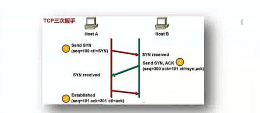
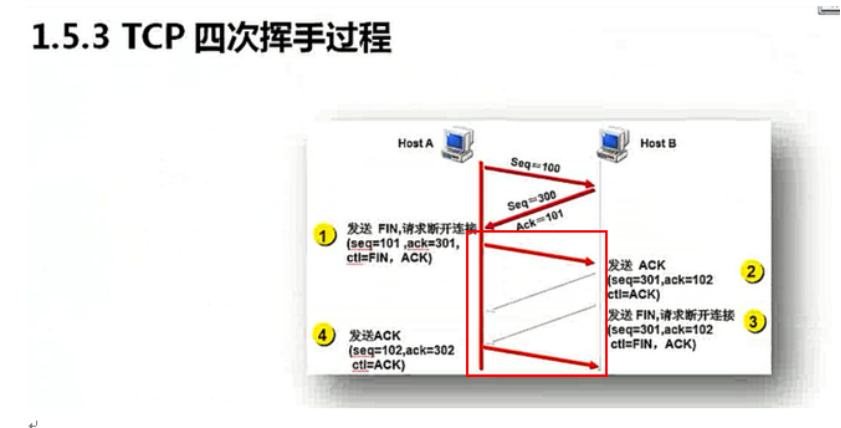
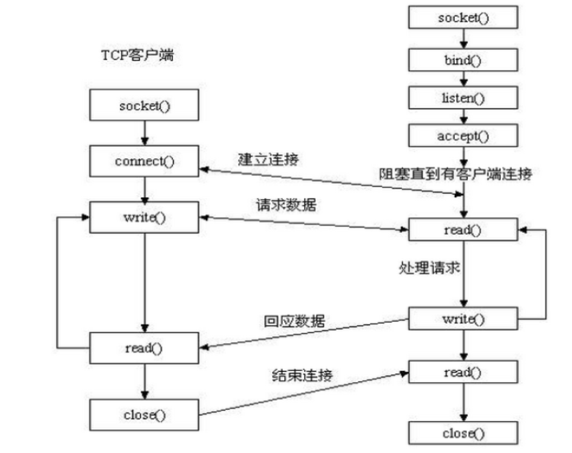

## 1.什么是C/S架构？
```
C指的是client（客户端软件），S指的是Server（服务端软件）
```

## 2.互联网协议是什么？分别介绍五层协议中每一层的功能？
```
计算机之间通信的标准，就是互联网协议
发送方按照协议规定的格式去阻止数据，接收方按照相同的协议解析结果，就能进行数据通信了
应用层：原始数据包
传输层：对数据包封装元端口和目标端口
网络层：继续封装原IP和目标IP
数据链路层：继续封装原Mac和目标Mac
物理层：把数据转换为0101二进制格式
```
## 3.基于tcp协议通信，为何建立链接需要三次握手，而断开链接却需要四次挥手
```
TCP是安全连接
```


## 4.为何基于tcp协议的通信比基于udp协议的通信更可靠？
```
因为tcp协议连接的建立要通过三次握手和四次挥手，要经过确认后才会进行数据的发送。
udp协议只需要发送数据，至于对方是否接收到，不管。但是udp协议通信更加快速。
```
## 5.‍流式协议指的是什么协议，数据报协议指的是什么协议？
```
tcp协议是流式协议
udp协议是数据报协议
```
## 6.什么是socket？简述基于tcp协议的套接字通信流程
```
socket是应用层与TCP/IP协议族通信的中间软件的一组接口。
```

## 7.什么是粘包？ socket 中造成粘包的原因是什么？ 哪些情况会发生粘包现象？
```

```
## 8.基于socket开发一个聊天程序，实现两端互相发送和接收消息
```

```
## 9.基于tcp socket，开发简单的远程命令执行程序，允许用户执行命令，并返回结果
```

```
## 10.基于tcp协议编写简单FTP程序，实现上传、下载文件功能，并解决粘包问题
```

```
## 11.基于udp协议编写程序，实现功能
```
执行指定的命令，让客户端可以查看服务端的时间
执行指定的命令，让客户端可以与服务的的时间同步
```
