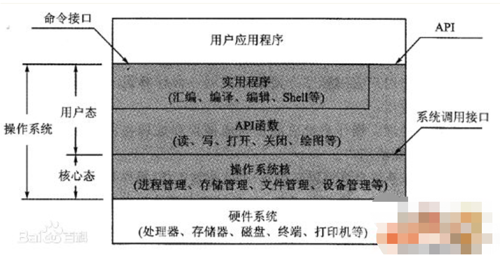

# 1、简述计算机操作系统中的“中断”的作用？
```
cpu会切：io阻塞、程序运行时间过长
中断：计算机执行期间，系统内发生任何非寻常的或非预期的急需处理事件，使得cpu暂时中断当前正在执行的程序而转去执行相应的事件处理程序。
待处理完毕后又返回原来被中断处继续执行或调度新的进程执行的过程。它使计算机可以更好更快利用有限的系统资源解决系统响应速度和运行效率的一种控制技术。
```
# 2、简述计算机内存中的“内核态”和“用户态”；
```
操作系统由操作系统的内核（运行于内核态，管理硬件资源）以及系统调用（运行于用户态，为应用程序员写的应用程序提供系统调用接口）两部分组成；

内核态：cpu可以访问内存的所有数据，包括外围设备，例如硬盘，网卡，cpu也可以将自己从一个程序切换到另一个程序。

用户态：只能受限的访问内存，且不允许访问外围设备，占用cpu的能力被剥夺，cpu资源可以被其他程序获取。
```

# 3.进程间通信方式有哪些？
```
队列,信号量,Event事件,定时器Timer,线程queue,进程池线程池,异步调用+回调机制
```
# 4.简述你对管道、队列的理解；
```
mutiprocessing模块为我们提供的基于消息的IPC通信机制：队列和管道。

队列和管道都是将数据存放于内存中，而队列又是基于（管道+锁）实现的，可以让我们从复杂的锁问题中解脱出来，因而队列才是进程间通信的最佳选择。

我们应该尽量避免使用共享数据，尽可能使用消息传递和队列，避免处理复杂的同步和锁问题，而且在进程数目增多时，往往可以获得更好的可获展性。
```
# 5.什么是同步I/O，什么是异步I/O？
```
同步IO返回的结果就是最终的结果
异步IO发出请求后，会立刻得到返回结果，但这个结果不是最终的结果
最终数据准备好了，会把数据发送给客户端
```
# 6.写一个程序，包含十个线程，子线程必须等待主线程sleep 10秒钟之后才执行，并打印当前时间；
```
import time
from threading import Event,Thread
def func(event):
    event.wait()
    print(time.localtime())
if __name__ == '__main__':
    event=Event()
    for i in range(10):
        t=Thread(target=func,args=(event,))
        t.start()
    time.sleep(10)
    event.set()
    print("main")
    
D:\software2\Python3\install\python.exe E:/PythonProject/new-python/python-test/BasicGrammer/test.py
main
time.struct_time(tm_year=2019, tm_mon=5, tm_mday=28, tm_hour=22, tm_min=20, tm_sec=58, tm_wday=1, tm_yday=148, tm_isdst=0)
time.struct_time(tm_year=2019, tm_mon=5, tm_mday=28, tm_hour=22, tm_min=20, tm_sec=58, tm_wday=1, tm_yday=148, tm_isdst=0)
time.struct_time(tm_year=2019, tm_mon=5, tm_mday=28, tm_hour=22, tm_min=20, tm_sec=58, tm_wday=1, tm_yday=148, tm_isdst=0)
time.struct_time(tm_year=2019, tm_mon=5, tm_mday=28, tm_hour=22, tm_min=20, tm_sec=58, tm_wday=1, tm_yday=148, tm_isdst=0)
time.struct_time(tm_year=2019, tm_mon=5, tm_mday=28, tm_hour=22, tm_min=20, tm_sec=58, tm_wday=1, tm_yday=148, tm_isdst=0)
time.struct_time(tm_year=2019, tm_mon=5, tm_mday=28, tm_hour=22, tm_min=20, tm_sec=58, tm_wday=1, tm_yday=148, tm_isdst=0)
time.struct_time(tm_year=2019, tm_mon=5, tm_mday=28, tm_hour=22, tm_min=20, tm_sec=58, tm_wday=1, tm_yday=148, tm_isdst=0)
time.struct_time(tm_year=2019, tm_mon=5, tm_mday=28, tm_hour=22, tm_min=20, tm_sec=58, tm_wday=1, tm_yday=148, tm_isdst=0)
time.struct_time(tm_year=2019, tm_mon=5, tm_mday=28, tm_hour=22, tm_min=20, tm_sec=58, tm_wday=1, tm_yday=148, tm_isdst=0)
time.struct_time(tm_year=2019, tm_mon=5, tm_mday=28, tm_hour=22, tm_min=20, tm_sec=58, tm_wday=1, tm_yday=148, tm_isdst=0)

Process finished with exit code 0

```
# 7.写一个程序，包含十个线程，同时只能有五个子线程并行执行；
```
from concurrent.futures import ThreadPoolExecutor
from threading import Thread,currentThread
import time
def func():
    print(currentThread().name)
    time.sleep(1)
if __name__ == '__main__':
    pool=ThreadPoolExecutor(5)
    for i in range(10):
        pool.submit(func)
    pool.shutdown(wait=True)
    print("main")


D:\software2\Python3\install\python.exe E:/PythonProject/new-python/python-test/BasicGrammer/test.py
<concurrent.futures.thread.ThreadPoolExecutor object at 0x0000011B6F0594A8>_0
<concurrent.futures.thread.ThreadPoolExecutor object at 0x0000011B6F0594A8>_1
<concurrent.futures.thread.ThreadPoolExecutor object at 0x0000011B6F0594A8>_2
<concurrent.futures.thread.ThreadPoolExecutor object at 0x0000011B6F0594A8>_3
<concurrent.futures.thread.ThreadPoolExecutor object at 0x0000011B6F0594A8>_4
<concurrent.futures.thread.ThreadPoolExecutor object at 0x0000011B6F0594A8>_0
<concurrent.futures.thread.ThreadPoolExecutor object at 0x0000011B6F0594A8>_1
<concurrent.futures.thread.ThreadPoolExecutor object at 0x0000011B6F0594A8>_3
<concurrent.futures.thread.ThreadPoolExecutor object at 0x0000011B6F0594A8>_4
<concurrent.futures.thread.ThreadPoolExecutor object at 0x0000011B6F0594A8>_2
main

Process finished with exit code 0

```
```
from concurrent.futures import ThreadPoolExecutor
from threading import Thread,currentThread,Semaphore
import time
def func(se):
    se.acquire()
    print(currentThread().name)
    time.sleep(1)
    se.release()
if __name__ == '__main__':
    se=Semaphore(5)
    for i in range(10):
        t=Thread(target=func,args=(se,))
        t.start()
    print("main")

D:\software2\Python3\install\python.exe E:/PythonProject/new-python/python-test/BasicGrammer/test.py
Thread-1
Thread-2
Thread-3
Thread-4
Thread-5
main
Thread-7
Thread-6
Thread-9
Thread-8
Thread-10

Process finished with exit code 0


```
# 8.写一个程序，使用socketserver模块，实现一个支持同时处理多个客户端请求的服务器，要求每次启动一个新线程处理客户端请求；
````
##服务端
import socketserver
class Handler(socketserver.BaseRequestHandler):
    def handle(self):
        print(‘connection:‘, self.client_address)
        while True:
            try:
                data = self.request.recv(1024)
                if not data:break
                print(‘client data:‘, data.decode())
                self.request.send(data.upper())
            except Exception as e:
                print(e)
                break
if __name__ == ‘__main__‘:
    server = socketserver.ThreadingTCPServer((‘127.0.0.1‘, 8080), Handler)
    server.serve_forever()
````
```
##客户端
import socket
client = socket.socket(socket.AF_INET, socket.SOCK_STREAM)
client.connect((‘127.0.0.1‘, 8080))
while True:
    msg = input(‘>>>:‘)
    if not msg:break
    client.send(msg.encode(‘utf-8‘))
    data = client.recv(1024)
    print(data.decode(‘utf-8‘))
```
# 9.写一个程序，要求用户输入用户名和密码，要求密码长度不少于6个字符，且必须以字母开头，如果密码合法，则将该密码使用md5算法加密后的十六进制概要值存入名为password.txt的文件，超过三次不合法则退出程序；
```
mport re, hashlib, json
def func():
    count = 0
    while count < 3:
        usename = input(‘usename:‘)
        password = input(‘password:‘)
        if len(password) <6 or not re.search(‘\A([a-z]|[A-Z])‘, password):
            count += 1
        else:
            obj = {‘usename‘:usename, ‘password‘:hashlib.md5(password.encode(‘utf-8‘)).hexdigest()}
            json.dump(obj, open(‘password.txt‘, ‘a‘, encoding=‘utf-8‘))
            break
if __name__ == ‘__main__‘:
    func()
```