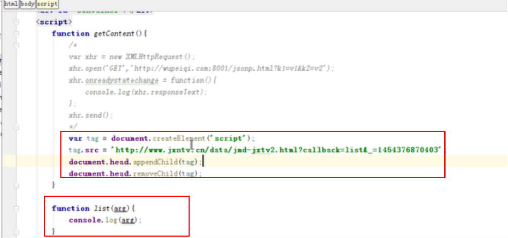
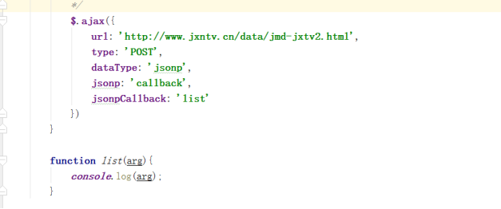
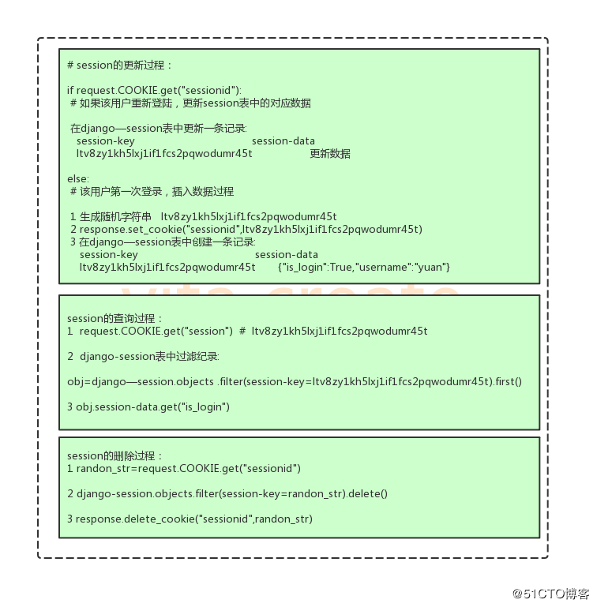
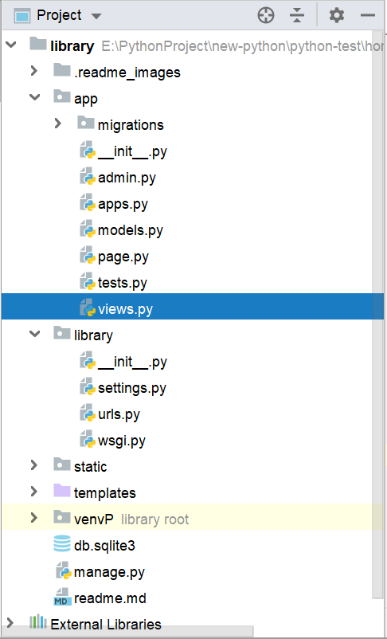

# 1.列举Http请求中常见的请求方式
```
get请求：
1.没有请求体，请求参数内容放在url中，如果是重要私密信息，使用get请求不安全
2.get请求的数据有大小限制，因为浏览器URL的长度有限制
3.在后端获取数据使用request.GET获取

post请求：
1.有请求体，请求的参数放在请求体中
2.post请求的数据没有大小限制
3.在后端获取数据使用requesr.POST获取
```
# 2.谈谈你对HTTP协议的认识。1.1 长连接
```
首先是网站请求的整个过程，
DNS解析
TCP三次握手
HTTP发送请求
HTTP响应请求
TCP四次挥手

实际的HTTP长连接和短连接本事是说的TCP连接。
长连接是一次TCP连接，可以进行多次HTTP请求，请求头中connection为keep-alive。
短连接是每次HTTP请求，都对应一次TCP的三次握手和四次挥手。
```
# 3.简述MVC模式和MVT模式
```
MVC--model-view-control,model是业务对象与数据库的映射，view是视图层，展示数据，control负责接收用户请求
MVT-model-view-template,model是业务对象与数据库的映射，view负责接收处理用户请求，template是展示信息给用户
```
# 4.简述Django请求生命周期
```
1.wsgi协议，将http请求发送的内容进行封装，传给web框架（django）
2.中间件的request，对请求进行校验或在请求对象中添加其他相关数据，例如csrf,requestsession.
3.路由匹配，根据浏览器发送的不同url匹配不同的视图函数
4.视图函数中，进行业务的逻辑处理和数据的处理
5.render返回，可以进行template模板的渲染，其中模板渲染可以通过filter和tag协助，进行数据的展示
6.中间的response，对响应数据进行处理
7.wsgi协议对数据进行封装，返回给HTTP协议。
```
# 5.简述什么是FBV和CBV
```
FBV是基于函数的视图--即views.py中是使用函数进行逻辑的处理
CBV是基于类的视图处理--及views.py中使用类，或类的继承来书写

CBV的优点
1.可以提高代码的复用性，可以使用面向对象的技术。
2.可以使用不同的函数处理不同的HTTP请求，而不需要使用if判断，提高了代码可读性。
```
# 6.谈一谈你对ORM的理解
```
ORM就是对象关系模型，在models.py中书写一些类，
通过python manage.py makemigrations 
python manage.py migrate生成表
利用ORM查询数据。
```
# 7.什么是中间件并简述其作用
```
中间件配置在了settings.py中
主要有process-request----请求进来时，权限认证
process-view----路由匹配后，经过process-view,到达视图函数
process-exception----视图函数中发生异常，执行process-exception
process-response----请求响应时执行
可以进行数据的校验和请求与响应数据的处理
```
# 8.django中怎么写原生SQL
```
1.安装mysql驱动，pip install pymysql或mysqlclient
2.settings.py中配置mysql数据库服务器相关信息
3.views.py中书写原生sql操作数据

from django.shortcuts import render
#导入`connection`
from django.db import connection

def index(request):
    cursor = connection.cursor()
    #要想使用sql原生语句，必须用到execute()函数
    #然后在里面写入sql原生语句
    cursor.execute("insert into book(id,name,author) values (null ,'三国演义','罗贯中')")
    return render(request,'index.html')
--------------------- 
作者：stu_xujin 
来源：CSDN 
原文：https://blog.csdn.net/xujin0/article/details/83515683 
版权声明：本文为博主原创文章，转载请附上博文链接！
```
# 9.F和Q的作用
```
# 1.F查询，两个字段值作比较
ret1 = Book.objects.filter(price__gt=F("publish_id"))
print(ret1)
# 2.F查询与常数之间的加减乘除和取模
ret2 = Book.objects.filter(price__gt=F("publish_id")*100)
print(ret2)
# 3.支持批量更新
Book.objects.all().update(price=F("price")+30)
    
    
# 1.Q查询可以用于“或”查询,filter()方法是“and”查询
ret1 =Book.objects.filter(Q(authors__name="vita")|Q(authors__name="lili"))
print(ret1)
# 2.可以组合&和|以及~(取反)
# 作者名是vita,age!=23
ret2 = Book.objects.filter(Q(authors__name="vita")&~Q(authors__age=23))
print(ret2)
# 3.查询函数可以混合使用Q对象和关键字参数。关键字参数要放在最后面
ret3 = Book.objects.filter(Q(authors__age=23)|Q(publishDate__year=2012),title__startswith="S")
```
# 10.values和value_list区别
```
values()与values_list()：
    返回相应的字段与对应的值。
调用者：
    queryset对象
返回值：
    queryset对象,values返回的是queryset的字典，values_list返回的是queryset的元组。
    values()：<QuerySet [{'title': 'python', 'price': Decimal('100.00')}, {'title': 'java', 'price': Decimal('100.00')}]>
    values_list()：<QuerySet [('python', Decimal('100.00')), ('java', Decimal('100.00'))]>
```
# 11.如何使用django orm批量创建数据
```
list = []
for i in range(60):
    item = Publish(name="publish_%s" % i, city="上海%s"%i,email="123@qq.com")
    list.append(item)

Publish.objects.bulk_create(list)
```
# 12.http访问流程
```
DNS解析
TCP三次握手
HTTP发送请求
HTTP发现响应
TCP四次挥手
```
# 13.命令migrate 和makemigrations的差别
```
makemigrations相当于在app下建立migrations目录，
并记录下所有关于models.py的改动，生成一个.py文件，但这个改动还没有作用到数据库中

migrate会把models.py的改动作用到数据库中
```
# 14.视图函数中，接收的请求对象常用方法和属性有哪些
```
request对象
1.HttpRequest.GET
    一个类似于字典的对象。
    get请求时，
    浏览器中手动设置参数http://127.0.0.1:8000/login/?user_name=vita&passwd=123
    <QueryDict: {'user_name': ['vita'], 'passwd': ['123']}>
    不手动设置参数http://127.0.0.1:8000/login/
    <QueryDict: {}>

2.HttpRequest.POST
    post请求时，
    form表单提交
    <QueryDict: {'user_name': ['vita'], 'passwd': ['123']}>

    http://127.0.0.1:8000/index/
    url:协议://IP:port/路径?get请求数据
3.HttpRequest.path
    表示请求的路径
    例如：请求http://127.0.0.1:8000/login/?user=vita&passwd=123
    print(request.path) # /login/
    print(request.get_full_path()) #/login/?user=vita&passwd=123

4.HttpRequest.get_full_path()
    返回path,如果有查询字符串，查询字符串也在路径中。

5.HttpRequest.method
    用于判断是GET请求还是POST请求

6.HttpRequest.FILES
    print(request.FILES)#<MultiValueDict: {'myfile': [<InMemoryUploadedFile: Java快捷键.txt (text/plain)>]}>
    print(type(request.FILES.get("myfile")))# <class 'django.core.files.uploadedfile.InMemoryUploadedFile'>
    一个类似于字典的对象，包含所有的上传文件信息。
    FILES总的每个键为<input type="file" name="" /> 中的name，值则为对应的数据。
    注意：FILES只有在请求的方法为POST且提交的<form>表单中带有属性enctype="multipart/form-data"的情况下才会有数据。
    否则，FILES将是一个空的类似于字典的对象。
7.request.session
    设置Sessions值
          request.session['session_name'] ="admin"
    获取Sessions值
          session_name = request.session["session_name"]
    删除Sessions值
          del request.session["session_name"]
          
8.cookie
    设置cookie
        rep = HttpResponse(...) 或 rep ＝ render(request, ...) 或 rep ＝ redirect()  
        rep.set_cookie(key,value,...)
        rep.set_signed_cookie(key,value,salt='加密盐',...)

    获取cookie
    request.COOKIES，返回值类型是dict。

    删除cookie
    response.delete_cookie("cookie_key",path="/",domain=name)
```
# 15.常用视图响应的方式是什么
```
response对象
响应对象主要有三种形式：
1.JsonResponse()
    返回dunmps后的json数据，并设置contentType为json,多用于ajax请求
2.HttpResponse()
    HttpResponse()括号中直接跟一个具体的字符串作为响应体，比较简单直接。

3.render(request, template_name,{"ctime":ctime}）
def render(request, template_name, context=None, content_type=None, status=None, using=None):
    """
    Return a HttpResponse whose content is filled with the result of calling
    django.template.loader.render_to_string() with the passed arguments.
    """
    content = loader.render_to_string(template_name, context, request, using=using)
    return HttpResponse(content, content_type, status)

render(request, "index.html",{"ctime":ctime})
结合一个给定的模板和一个上下文字典，把字典中的数据渲染到html页面中。
request：用于生成响应的请求对象。
template_name：html模板名称，可选参数。
context：默认是一个字典。如果字典中的某个值是可调用的，视图将在渲染模板之前调用它。
render方法就是把一个模板页面中的模板语法进行渲染，最终渲染成一个html页面为响应体。

4.redirect()
1）传递要重定向的一个硬编码URL
def my_view(request):
    ...
    return redirect('/some/url/')def my_view(request):
    ...
    return redirect('http://example.com/')

2）也可以是一个完整的URL
def my_view(request):
    ...
    return redirect('http://example.com/')

3）发送了两次请求       ,返回码是302(login为旧地址，auth为跳转的地址)
[23/Jun/2019 10:26:15] "GET /login/ HTTP/1.1" 302 0
[23/Jun/2019 10:26:15] "GET /auth/ HTTP/1.1" 200 4

4）return http.HttpResponsePermanentRedirect ('http://www.baidu.com/')，返回码是301，发送了一次请求
[23/Jun/2019 10:32:50] "GET /login/ HTTP/1.1" 301 0

5）302与301的区别：
django实现302临时重定向的代码，也可以使用上面的redirect
from django import http
def view(request):
  return http.HttpResponseRedirect('http://www.baidu.com/')

django实现301永久重定向
from django import http

def view(request):
  return http.HttpResponsePermanentRedirect ('http://www.baidu.com/')

相同点：
1）都表示重定向，浏览器自动跳转到一个新地址，用户看到的效果是输入的A地址瞬间变为了B地址。

不同点：
1）301表示永久跳转，旧地址被永久的移除了（这个资源不可访问了），搜索引擎在抓取新内容的同时，也将旧地址转换为新地址。
永久跳转在后端实际只发生一条请求log，为新地址。
2）302表示临时跳转，旧的资源依然可以访问。
临时跳转在后端发生了两条请求log，分别为旧地址和新地址。
```
# 16.HTTP响应常见状态码分类
```
1）301表示永久跳转，旧地址被永久的移除了（这个资源不可访问了），搜索引擎在抓取新内容的同时，也将旧地址转换为新地址。
永久跳转在后端实际只发生一条请求log，为新地址。
2）302表示临时跳转，旧的资源依然可以访问。
临时跳转在后端发生了两条请求log，分别为旧地址和新地址。
403 权限配置或nginx配置
404 访问页面不存在
500 后端程序报错
502 bad gateway反向代理的后端服务不可用
```
# 17.路由匹配原则是什么？
```
从上到下进行匹配，只要匹配到了，就不再向下匹配
```
# 18.缓存系统类型有哪些
```
redis,memcache,codis
```
# 19.解决跨域的常用方式是什么？
```
由于浏览器具有同源策略，阻止ajax请求，无法阻止<script src="..."></script>
巧妙之处：
    创建script标签
    src=远程地址
    返回的数据必须是js格式
```
## 19.1jsonp跨域请求的本质
```
在head中创建一个<script src="..."></script>，src=远程地址
因为浏览器同源问题，无法阻止该标签
```

## 19.2jsonp跨域请求jquery方式

# 20.Django中想验证表单提交是否格式正确需要用到Form中的哪个函数
```
form.is_avalid()是form中的字段全部验证通过
form.clean_data()验证通过的数据，字典形式
```
# 21.Django中如何读取和保存session，整个session的运行机制是什么
```
request.session
    设置Sessions值
          request.session['session_name'] ="admin"
    获取Sessions值
          session_name = request.session["session_name"]
    删除Sessions值
          del request.session["session_name"]
```

# 22.简述Django对http请求的执行流程
```
Django请求生命周期
```
# 23.查询集的两大特性？什么是惰性执行
```
1.惰性执行
books = BookInfo.objects.all() # 此时,数据库并不会进行实际查询
# 只有当真正使用时,如遍历的时候,才会真正去数据库进行查询
for b in books:
    print(b)


2.缓存
# 进行数据库实际查询遍历,保存结果到bs,会进行数据库实际交互
bs = [b.id for b in BookInfo.objects.all()]
 
# 再次调用缓存结果bs,不再进行数据库查询,而是使用缓存结果
print(bs) # [1, 2, 3, 4, 5, 6, 7, 10]
 
```
# 24.查询集返回的列表过滤器有哪些
```
filter()
all()
exclude()
.first()
.last()
.orderby()
.nannotate()
```
# 25.django路由系统中include是干嘛用的
```
包含其他的html页面代码到当前页面中
```
# 26.django2.0中的path与django1.xx里面的url有什么区别？
```
django1.xx中的url可以进行正则匹配，使用()时，传的是字符串给视图函数

django2.x
path中可以直接进行参数类型的转换
path("articles/<int:year>/", views.year_archive),
path不能进行正则匹配，re_path可以
```
# 27.urlpatterns中的name与namespace有什么作用？你是如何使用的？
```
name
在html中我们会需要设置一些跳转页面的url，
在视图函数中，我们在重定向的时候，会使用url
我们不希望硬编码这些URL，希望设计一种与urls.py中配置对应的动态的URL。

在html中：使用url模板标签---<a href="">随笔</a>
在python代码中：使用django.urls.reverse
re_path(r"^article/([0-9]{4})/$", views.year_archive, name='year_archive'),

 redirect_url = reverse('year_archive', args=(year,))
    print(redirect_url)  # /article/2004/
    
namespace
由于name没有作用域，Django在反向解析URL时，会在全局项目搜索，找到一个name指定的URL时，立即返回。
当我们项目中有多个app时，可能会出现name相同的情况，为了避免name相同引发的解析异常，引入了名称空间。
from django.contrib import admin
from django.urls import path, re_path, include
urlpatterns = [
    path('admin/', admin.site.urls),
    re_path(r"^app1/", include('app1.urls', namespace="app1")),
    re_path(r"^app2/", include('app2.urls', namespace="app2")),
]

def year_archive(request, year):
    redirect_url = reverse('app1:year_archive', args=(year,))
    return HttpResponse("app1 %s"% redirect_url)
```
# 28.如何根据urlpatterns中的name反向生成url,这样反向生成url的方式有几种？
```
在html中：使用url模板标签---<a href="">随笔</a>
在python代码中：使用django.urls.reverse
re_path(r"^article/([0-9]{4})/$", views.year_archive, name='year_archive'),

 redirect_url = reverse('year_archive', args=(year,))
    print(redirect_url)  # /article/2004/
```
# 29.如何给一个字段设置一个主键？
```
nid = models.AutoField(primary_key=True)
```
# 30.blank=True与null=True有什么区别？
```
null = True 表示空值将会被存储为NULL
blank = True 表示在页面当中对应的表单可以为空，可以不填任何内容
```
# 31.DateTimeField类型中的auto_now与auto_now_add有什么区别
```
相同点：
1.第一次创建对象时，默认是当前时间
2.无法手动对该字段设置值
3.在admin中，是看不到该字段的，如果想要看到该字段，可以在Modelsz中设置readonly

不同点
1.auto_now在改行数据的其他字段更新时，该字段会强制更新为当前时间。。可应用于博客的最近更新。
2.auto_add_now在该行数据的其他字段更新时，该字段不会被更新。。可用于博客的创建时间。
```
# 31.values()与values_list()有什么区别？
```
values()与values_list()：
    返回相应的字段与对应的值。
调用者：
    queryset对象
返回值：
    queryset对象,values返回的是queryset的字典，values_list返回的是queryset的元组。
    values()：<QuerySet [{'title': 'python', 'price': Decimal('100.00')}, {'title': 'java', 'price': Decimal('100.00')}]>
    values_list()：<QuerySet [('python', Decimal('100.00')), ('java', Decimal('100.00'))]>
```
# 32当删除一个外键的时候，如何把与其关联的对应关系删除.
```
解除绑定
book_obj.authors.remove()      # 将某个特定的对象从被关联对象集合中去除。    ======   book_obj.authors.remove(*[])
book_obj.authors.clear()       #清空被关联对象集合
book_obj.authors.set()         #先清空再设置

自动解除绑定
on_delete=models.CASCADE
blog = models.OneToOneField(to="Blog", to_field="id", null=True, on_delete=models.CASCADE)

from django.shortcuts import render
from app1.models import *
def index(request):
    vita = Author.objects.filter(name="vita").first()
    aa_book_obj = Book.objects.filter(title="CC_title").first()
    # 方式一：remove-author对象
    aa_book_obj.authors.remove(vita)
    # 方式二：remove-author的nid
    aa_book_obj.authors.remove(2)
    bb_book_obj = Book.objects.filter(title="DD_title").first()
    # 方式三：remove-*[1,2]
    bb_book_obj.authors.remove(*[1,2])
    return render(request, "index.html")
```
# 33.多对多关联的表，如何插入数据？如何删除数据？如何更新数据？
```
插入数据

from django.shortcuts import render
from app1.models import *
def index(request):
    # 绑定多对多关系
    cc_book_obj = Book.objects.create(title="CC_title",publishDate="2018-12-12",price=120,publish_id=1)
    vita = Author.objects.get(name="vita")
    lili = Author.objects.get(name="lili")
    # 方式一：add-author对象
    cc_book_obj.authors.add(vita,lili)
    # 方式二：add-author_id
    dd_book_obj = Book.objects.create(title="DD_title",publishDate="2018-12-12",price=120,publish_id=1)
    dd_book_obj.authors.add(1,2)
    # 方式三：add-*[1,2,3]
    ee_book_obj = Book.objects.create(title="EE_title", publishDate="2018-12-12", price=120, publish_id=1)
    ee_book_obj.authors.add(*[1,2])
    return render(request, "index.html")
    
    
book_obj = Book.objects.create(title=book_title, price=book_price,
                                               publishDate=book_publish_date, publish_id=book_publish_id)
# print(book_author_id_list)  # ['2', '3']

book_obj.authors.add(*book_author_id_list)


更新数据
Book.objects.filter(id=book_id).update(title=book_title, price=book_price,
                                                       publishDate=book_publish_date, publish_id=book_publish_id)
# print(book_author_id_list)  # ['2', '3']

# edit_book_obj.authors.clear()
# edit_book_obj.authors.add(*authors_id_list)

book_obj.authors.set(book_author_id_list)

调用delete删除的时候，关联表中的数据也会删除
 Book.objects.filter(id=book_id).delete()
 也可使用remove,clear来删除
```
# 34.django的M2M关系，如何手动生成第三张表？
```
class ArticleToTag(models.Model):
    """
    文章和标签的中间关联表
    """
    nid = models.AutoField(primary_key=True)
    article = models.ForeignKey(to="Article", to_field="id", on_delete=models.CASCADE, verbose_name="关联的文章")
    tag = models.ForeignKey(to="Tag", to_field="id", on_delete=models.CASCADE, verbose_name="关联的标签")

    class Meta:
        # 设置联合主键
        unique_together = [
            ('article', 'tag'),
        ]

    def __str__(self):
        return self.article.title+"_"+self.tag.title
```
# 35.在视图函数中，常用的验证装饰器有哪些？
```
@login_required
在settings.py中配置LOGIN_URL,这样，没有登陆的用户，会自动跳转到登录页面
```
# 36.web框架的本质是什么？
```
所有的Web应用本质上就是一个socket服务端，而用户的浏览器就是一个socket客户端
```
# 37.创建Django工程、Django app、以及运行的命令
```
创建工程
django-admin.py startproject my_project

创建APP
python3 manage.py startapp my_app

启动
# make new migrations
python3 manage.py makemigrations
# apply all migrations
python3 manage.py migrate
# run server
python3 manage.py runserver

创建超级用户
python3 manage.py createsuperuser
# 输入http://127.0.0.1:8000/admin登录后台
```
# 38.Django App的目录结构
```

```

# 39.Django 获取用户前端请求数据的几种方式
```
request.GET----获取get请求的数据
request.POST----获取POST请求的数据
request.FILES----获取文件对象
request.COOKIES----获取cookie中的数据
request.session[]----获取session中的数据

```
# 40.描述下 自定义simple_tag
```
1.在settings中的INSTALLED_APPS配置当前app,否则Django无法找到自定义的simple_tag。
2.在app中创建templatetags模块(模块名只能是templatetags)。
3.创建任意.py文件，如：my_tags.py。
from django import template

# 只能是register，不能是别的名字
register=template.Library()

@register.filter
def multi_fliter(x,y):

    return x*y

@register.simple_tag
def multi_tag(x,y):

    return x*y

4.在html中导入my_tags.py
<!--加载my_tags.py-->
    
5.使用过滤器和标签
<!--filter最多只能传两个参数-->
    {{ num|filter_multi:2 }}
<!--filter可以用于if判断-->
    
        <p>{{ num|filter_multi:2 }}</p>
    
<!--tag可以传多个参数-->
    
<!--simple_tag不可以用于if判断-->

自定义的filter和simple_tag的区别
1.filter最多只能传两个参数，可以用于if判断，使用{{}}。
2.simple_tag可以传多个参数，不能用于if判断，使用。
```
# 41.什么是Cookie、如何获取、设置Cookie
```     
8.cookie
    设置cookie
        rep = HttpResponse(...) 或 rep ＝ render(request, ...) 或 rep ＝ redirect()  
        rep.set_cookie(key,value,...)
        rep.set_signed_cookie(key,value,salt='加密盐',...)

    获取cookie
    request.COOKIES，返回值类型是dict。

    删除cookie
    response.delete_cookie("cookie_key",path="/",domain=name)
```
# 42.什么是session，与cookie的对比、设置、获取、清空session
```
7.request.session
    设置Sessions值
          request.session['session_name'] ="admin"
    获取Sessions值
          session_name = request.session["session_name"]
    删除Sessions值
          del request.session["session_name"]
```
# 43.什么是CSRF，及防范方式
```
csrf是django的一个中间件，目的是防止客户端没有访问页面，就提交数据

在html的form表单中添加的标签，会在html中生成一个隐藏的input标签，value是一串随机字符
在提交数据时，
可以设置header：$.cookie()方式
可以直接在ajax的data中设置csrfmiddlewaretoken: $("[name='csrfmiddlewaretoken']").val()
```
# 44.WSGI / uwsgi/ uWSGI区分
```
#WSGI:
#    web服务器网关接口,是一套协议。用于接收用户请求并将请求进行初次封装，然后将请求交给web框架
#    实现wsgi协议的模块：
#        1.wsgiref,本质上就是编写一个socket服务端，用于接收用户请求(django)
#        2.werkzeug,本质上就是编写一个socket服务端，用于接收用户请求(flask)
#uwsgi:
#    与WSGI一样是一种通信协议，它是uWSGI服务器的独占协议,用于定义传输信息的类型
#uWSGI:
#    是一个web服务器,实现了WSGI协议,uWSGI协议,http协议,
```
# 45.QueryDict和dict区别
```
7.request.session
    设置Sessions值
          request.session['session_name'] ="admin"
    获取Sessions值
          session_name = request.session["session_name"]
    删除Sessions值
          del request.session["session_name"]
```

# 7.rest_framework 认证组件的流程
```
信号的作用是什么？
Django的Model的继承有几种形式，分别是什么?
orm如何取消级联
Django中当用户登录到A服务器进入登陆状态，下次被nginx代理到B服务器会出现什么影响
如何获取django urlpatterns里面注册的所有url?
如何设置一个带有枚举值的字典？
selected_related与prefetch_related有什么区别？
class Meta中的元信息字段有哪些
如何给一个视图函数加上缓存？
如何使用django加密
QueryDict和dict区别
```
