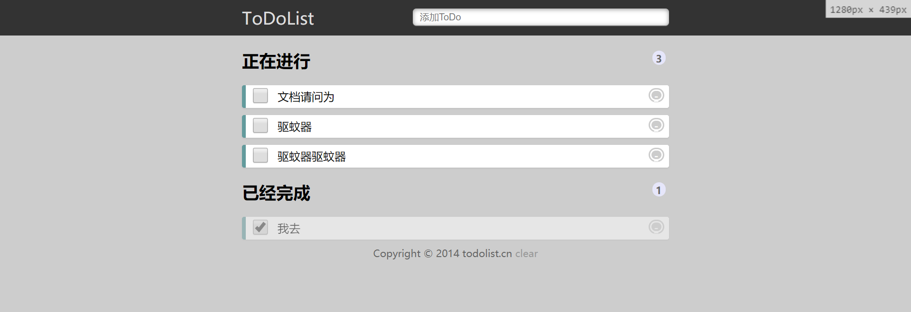
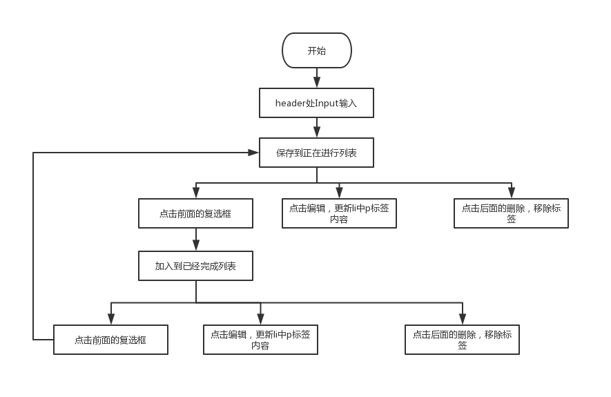

# 1.需求
```
参考链接http://www.todolist.cn/
1. 将用户输入添加至待办项
2. 可以对todolist进行分类（待办项和已完成组），用户勾选既将待办项分入已完成组
3. todolist的每一项可删除和编辑
4. 下方有clear按钮，并清空所有todolist项
```
# 2.程序启动方式
```
使用谷歌浏览器运行index.html
本次代码，每个标签的创建和删除都着重采用appendChild(),removeChild()来进行操作
```
# 3.程序运行效果

# 4.流程图
