# 1.需求
```
基础需求：
1. 实现用户登录、注册
2. 列出图书列表、出版社列表、作者列表
3. 点击作者，会在新的页面列出该作者出版的图书列表
4. 点击出版社，会列出该出版社旗下图书列表
5. 可以创建、修改、删除 图书、作者、出版社

升级需求：
1. 点击修改按钮，弹出模块框，模态框中展示该书的信息且信息可以修改，
2. 书名不可重复，不可修改
3. 修改图书信息时，使用ajax请求发送信息
```
# 2.注意事项
```
批量创建测试数据
出版社批量创建
list = []
for i in range(60):
    item = Publish(name="publish_%s" % i, city="上海%s"%i,email="123@qq.com")
    list.append(item)

Publish.objects.bulk_create(list)

作者批量创建
list = []
for i in range(60):
    item = Author(name="author_%s" % i, age=23)
    list.append(item)

Author.objects.bulk_create(list)

书籍批量创建
list = []
for i in range(100):
    item = Book(title="book_%s" % i,publishDate="2019-12-23",price=123,publish_id=1 )
    list.append(item)

Book.objects.bulk_create(list)

django版本 2.2.2
python版本3.6.2

使用sqlite报错,所以使用了MySQL，实际工作中也会使用MySQL
Python int too large to convert to C long

需要模块
pip install pymysql

由于django对pymysql的支持，运行时需要在本地做如下修改
```
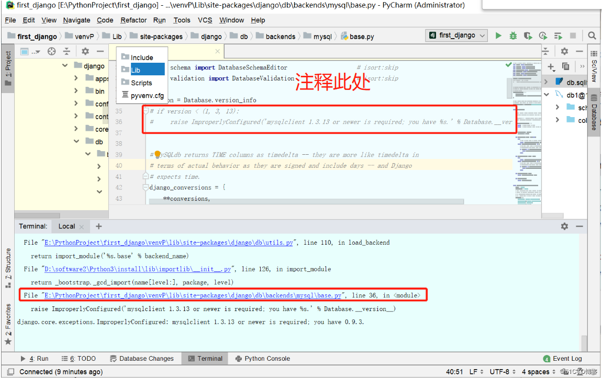
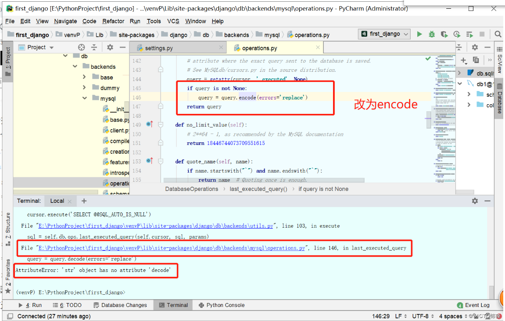
# 3.运行
```
python manage.py runserver 8000
```
# 4.运行效果图
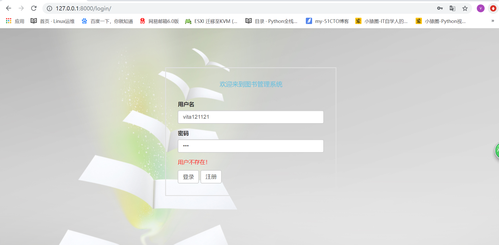
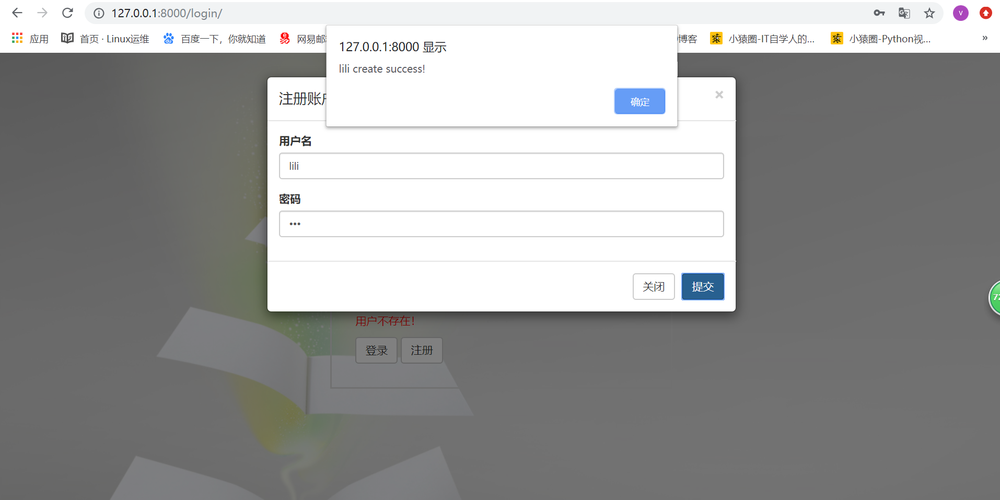
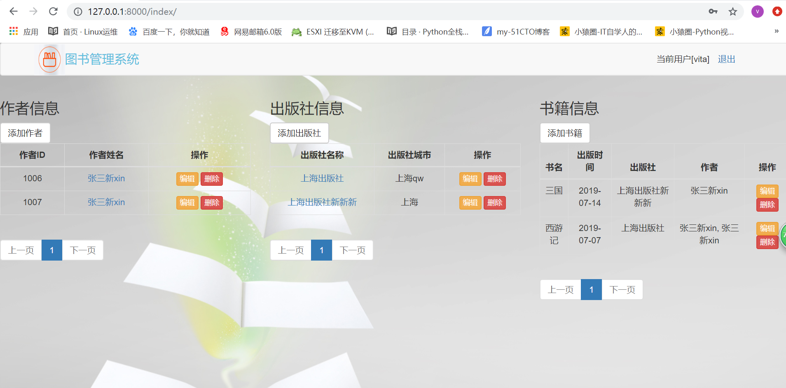
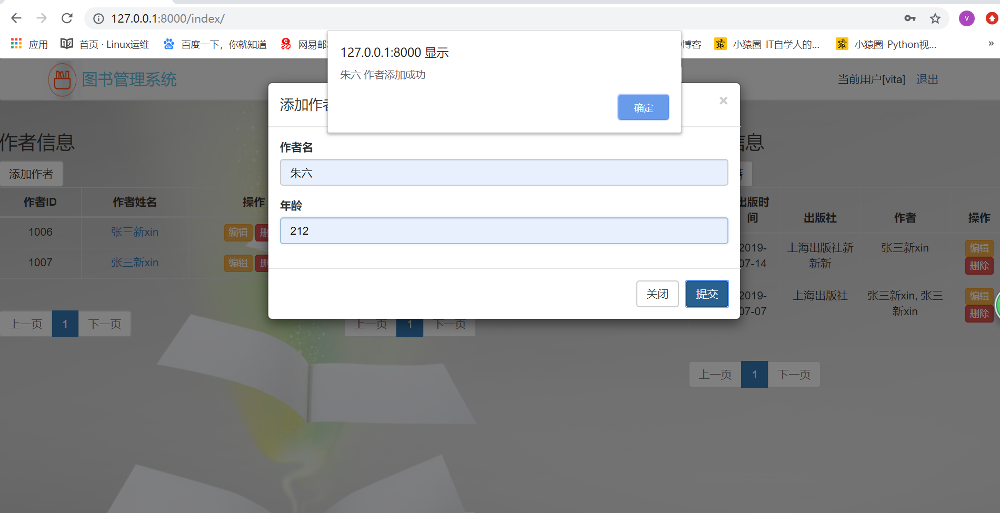
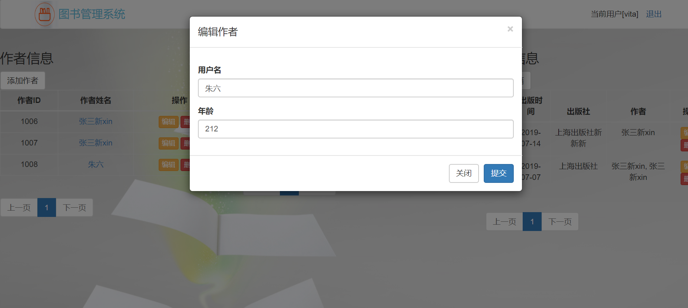
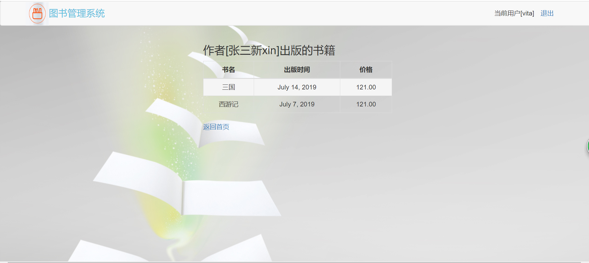
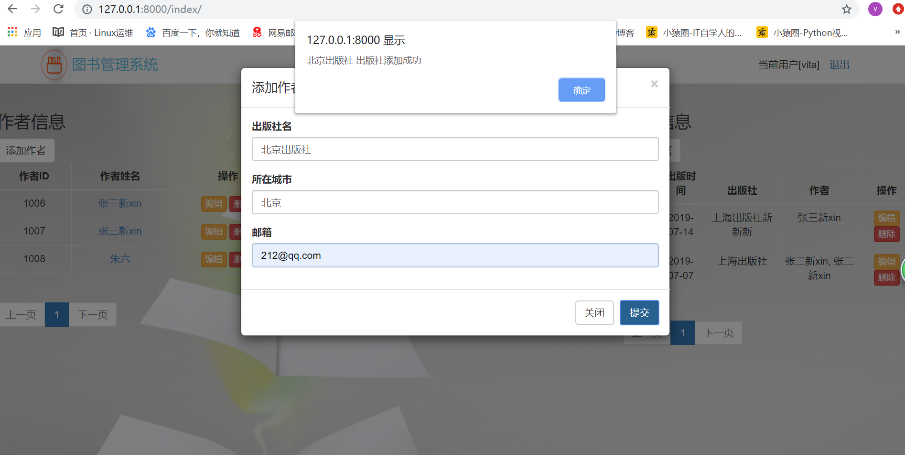
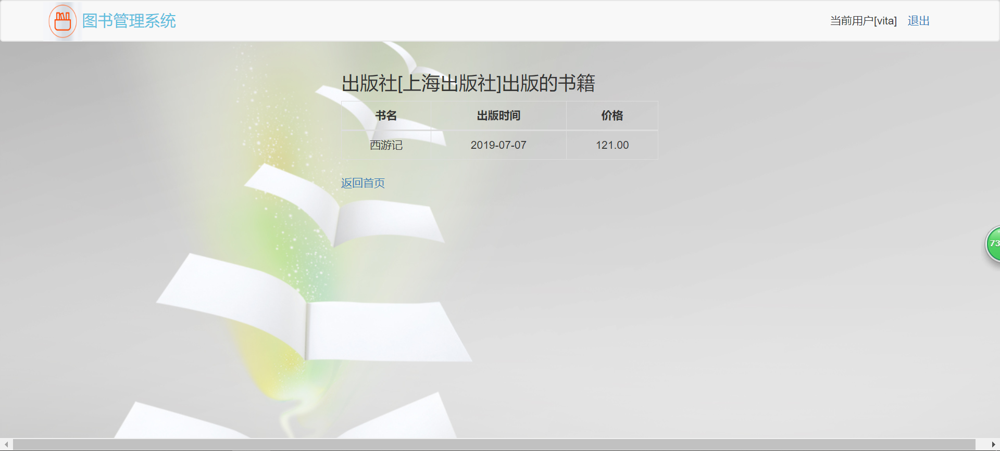
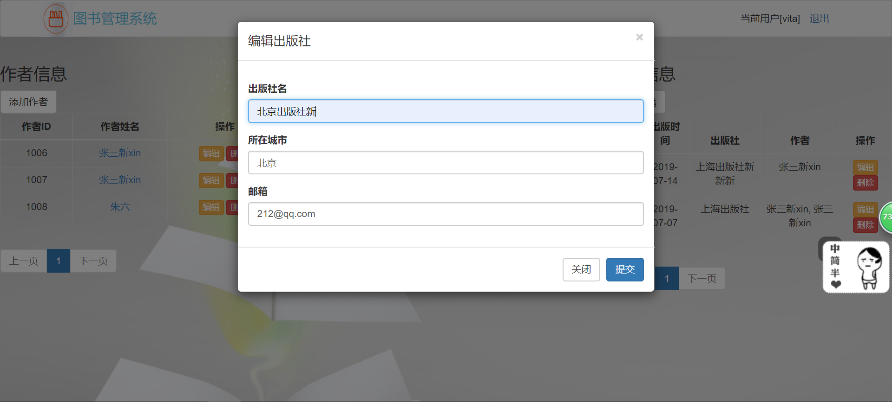
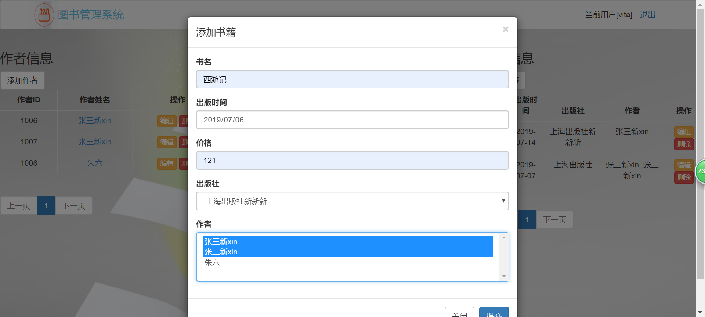
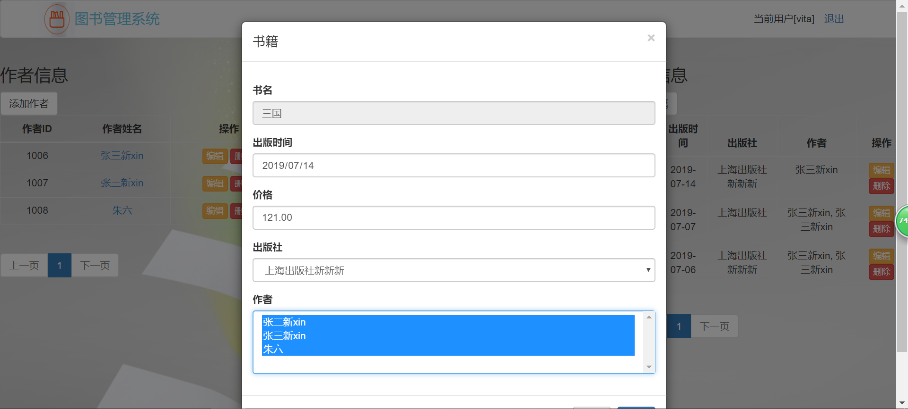
