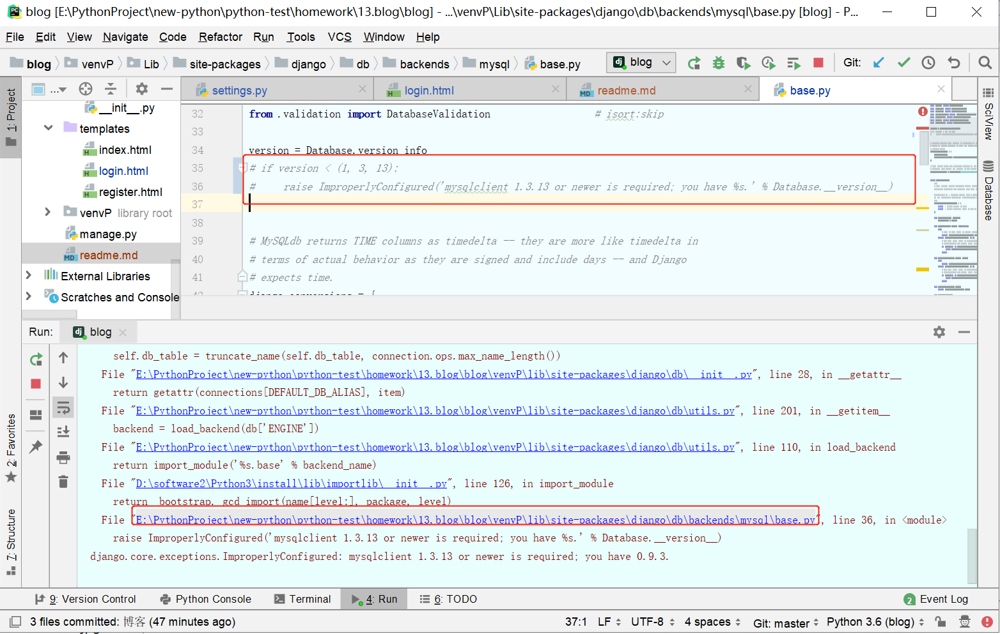
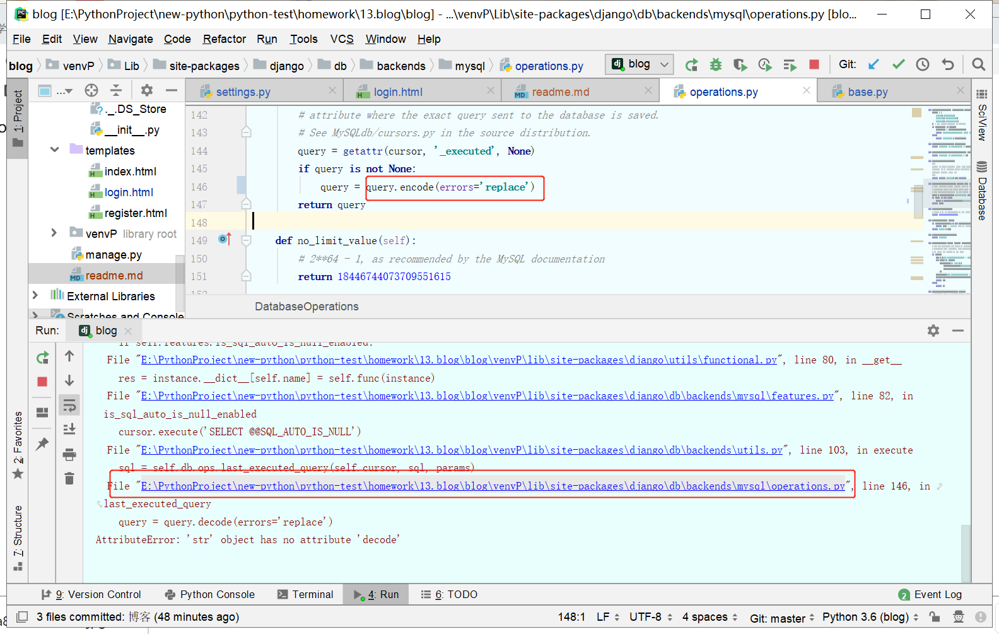
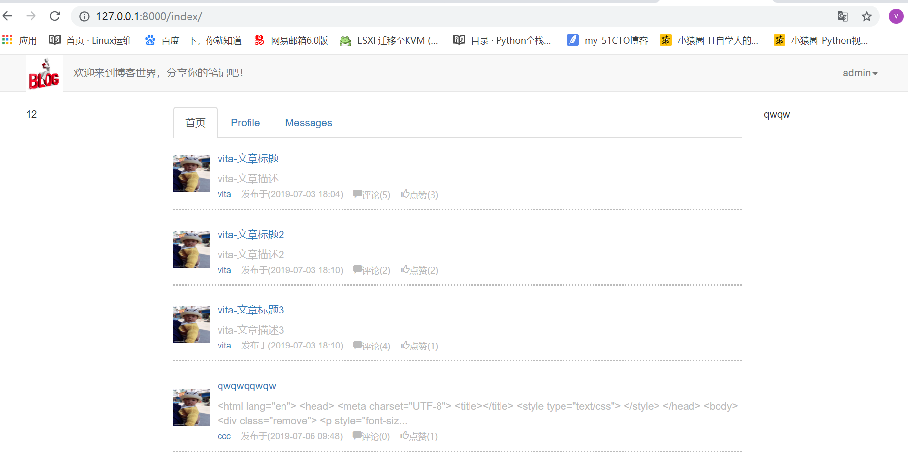
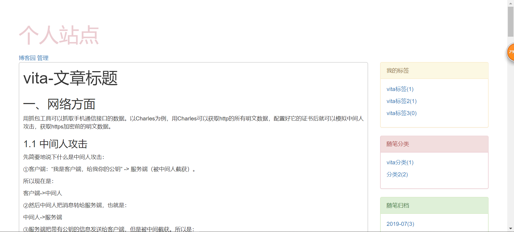
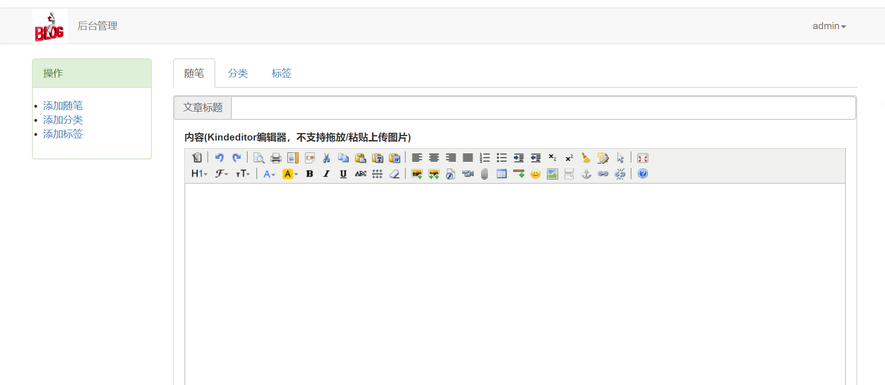
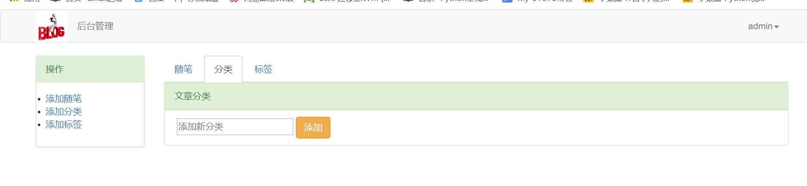
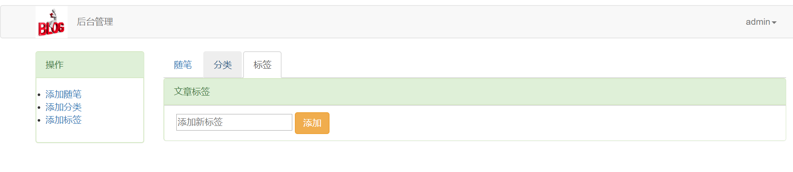
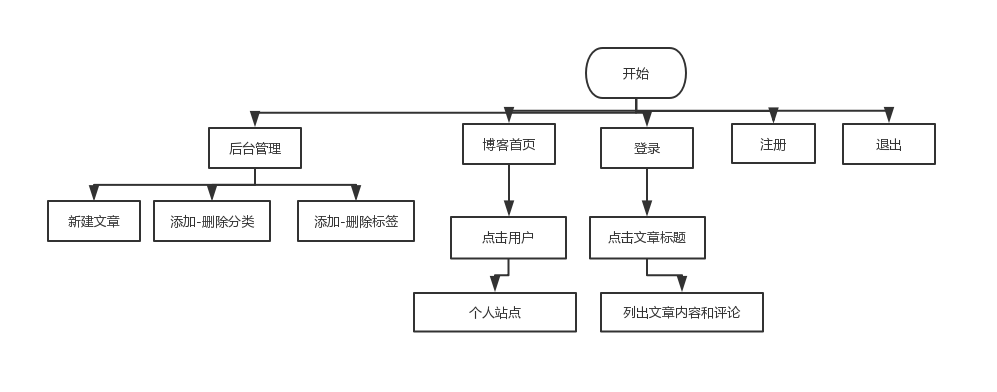

#1.需求
```
1. 基于ajax和用户认证组件实现登录验证
2. 基于ajax和form组件实现注册功能
3. 系统首页文章列表的渲染
4. 个人站点页面设计
5. 文章详细页的继承
6. 点赞与踩
7. 评论功能
8. 富文本编辑器的使用
9. 防止xss攻击
```
# 2.环境
```
django 2.2.2
python 3.6.2

由于报错，下面截图中的两处需要在本地修改
mysql

  File "E:\PythonProject\new-python\python-test\homework\13.blog\blog\venvP\lib\site-packages\django\db\backends\mysql\base.py", line 36, in <module>
    raise ImproperlyConfigured('mysqlclient 1.3.13 or newer is required; you have %s.' % Database.__version__)
django.core.exceptions.ImproperlyConfigured: mysqlclient 1.3.13 or newer is required; you have 0.9.3.

sql = self.db.ops.last_executed_query(self.cursor, sql, params)
  File "E:\PythonProject\new-python\python-test\homework\13.blog\blog\venvP\lib\site-packages\django\db\backends\mysql\operations.py", line 146, in last_executed_query
    query = query.decode(errors='replace')
AttributeError: 'str' object has no attribute 'decode'
```


# 3.启动方式
```
安装依赖包
pip install pymysql
pip install bs4
pip install pillow
pip install social-auth-app-django 需要安装这个，滑动验证才能运行成功
certifi==2017.7.27.1
chardet==3.0.4
geetest==3.0.0
idna==2.6
pytz==2017.3
requests==2.18.4
urllib3==1.22


初始化数据
python manage.py makemigrations
python manage.py migrate
创建管理用户,也可以不创建
python manage.py createsuperuser
```

# 4.运行效果
```

```





# 5.流程图

