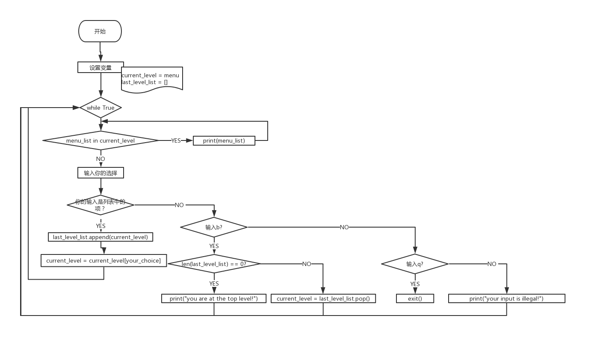

# 1.程序实现功能
```
1. 可依次选择进入各子菜单
2. 可从任意一层往回退到上一层
3. 可从任意一层退出程序
4. 使用一个while循环，且整体代码量不超过15行
```
# 2.程序启动方式


# 3.登录用户信息
该程序不需要用户登录
# 4.程序运行结果
```
E:\PythonProject\python-test\venvP3\Scripts\python.exe E:/PythonProject/python-test/homework/threelevelmenu/menu.py
北京
上海
山东
input your choice(b-back to last level|q-quit)北京
海淀
昌平
朝阳
东城
input your choice(b-back to last level|q-quit)问问  --输入一个不存在的
your input is illegal!
海淀
昌平
朝阳
东城
input your choice(b-back to last level|q-quit)昌平
沙河
天通苑
回龙观
input your choice(b-back to last level|q-quit) --什么都不输入
your input is illegal!
沙河
天通苑
回龙观
input your choice(b-back to last level|q-quit)b 
海淀
昌平
朝阳
东城
input your choice(b-back to last level|q-quit)b
北京
上海
山东
input your choice(b-back to last level|q-quit)b --已经回退到最顶层了
you are at the top level!
北京
上海
山东
input your choice(b-back to last level|q-quit)q  --退出

Process finished with exit code 0

```
# 5.程序流程图
