# 1.程序实现功能
```
本次作业没有添加过多的多于需求，只是在现有需求上进行了一些优化。
1. 启动程序后，输入用户名密码后，让用户输入工资，然后打印商品列表
2. 允许用户根据商品编号购买商品
3. 用户选择商品后，检测余额是否够，够就直接扣款，不够就提醒
4. 可随时退出，退出时，打印已购买商品和余额
5. 在用户使用过程中， 关键输出，如余额，商品已加入购物车等消息，需高亮显示
6. 用户下一次登录后，输入用户名密码，直接回到上次的状态，即上次消费的余额什么的还是那些，再次登录可继续购买
7. 允许查询之前的消费记录  --这里每次购买后都会展示消费记录
```
# 2. 程序启动方式
```
python版本:python3.6.3
```

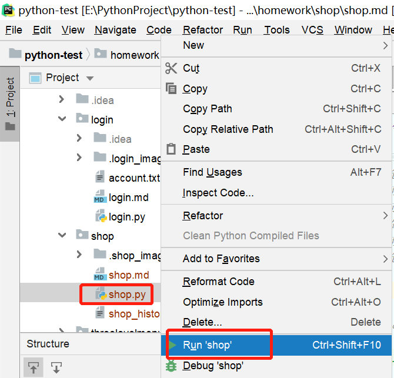
# 3.登录用户信息
```
这里用户登录信息直接存储在字典里了，用户登录方面没做锁定的复杂需求，这里对用户账户信息简单化了
accounts = {'vita': '123456', 'lyly': '1234567'}
```
# 4.程序运行效果
文件初始
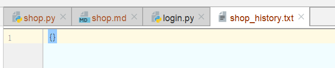
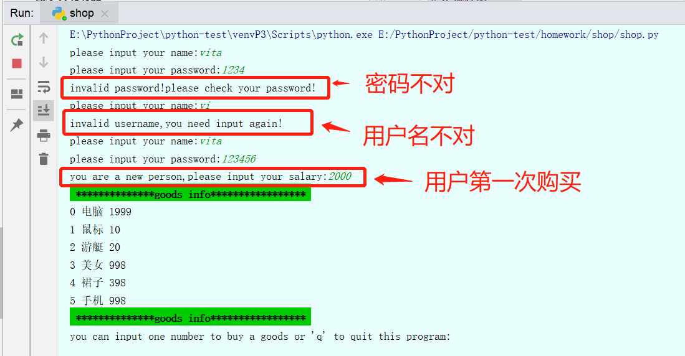
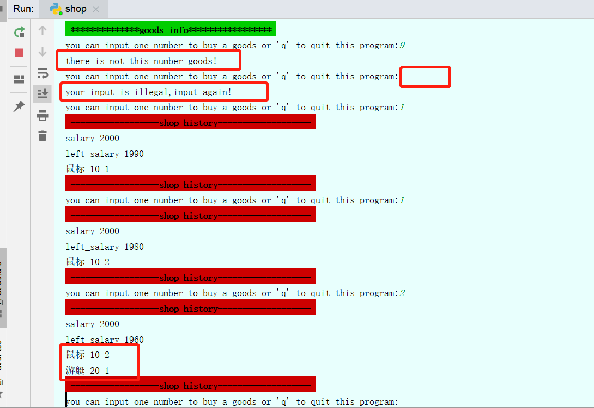
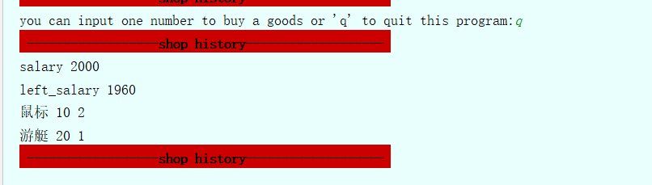
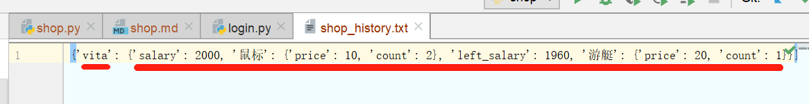
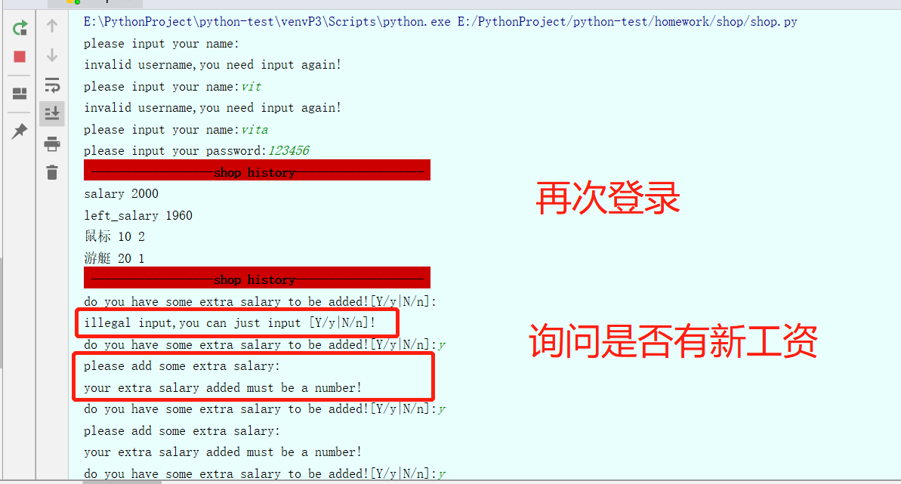
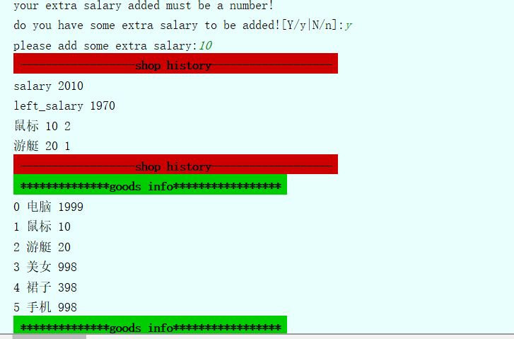


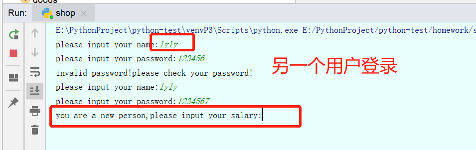
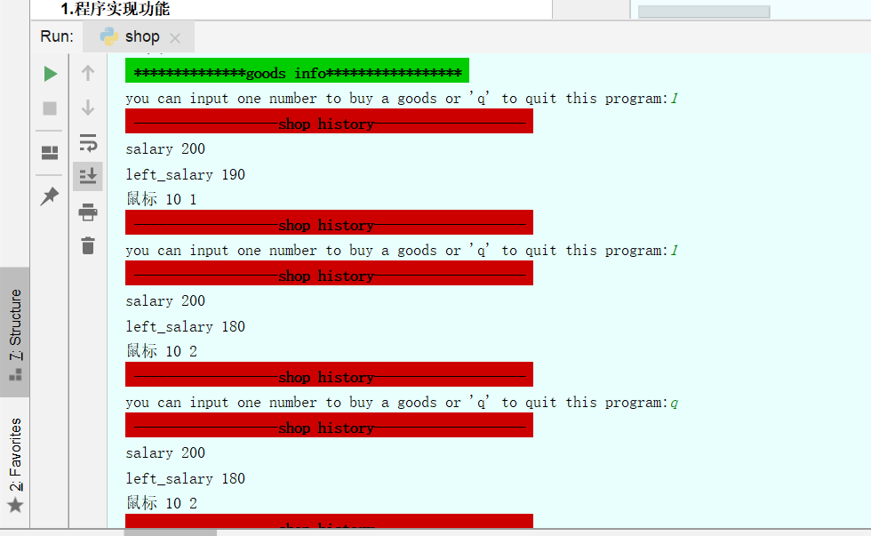
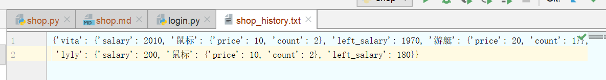
# 5.流程图
