# 1.程序的实现功能
```
1. 用户额度 15000或自定义
2. 实现购物商城，买东西加入 购物车，调用信用卡功能进行结账
3. 可以提现，手续费5%
4. 支持多账户登录
5. 支持账户间转账（用户A转账给用户B，A账户减钱、B账户加钱）
6. 记录每月日常消费流水
7. 提供还款功能
8. ATM记录操作日志（使用logging模块记录日志）
9. 提供管理功能，包括添加账户、用户额度，冻结账户等。。。
10. 用户认证用装饰器
```
# 2.程序的启动方式
```
python版本3.6.2
```
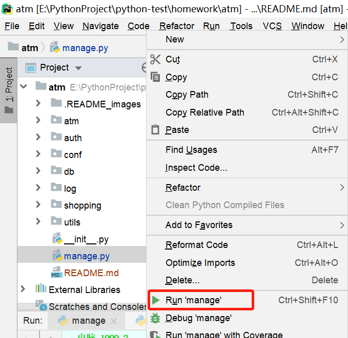
# 3.程序的登录信息
```
登录的账户的用户名和密码保存位置
```
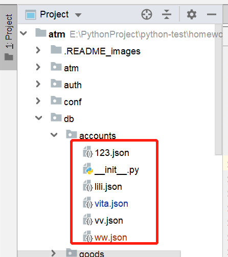
# 4.程序的运行效果

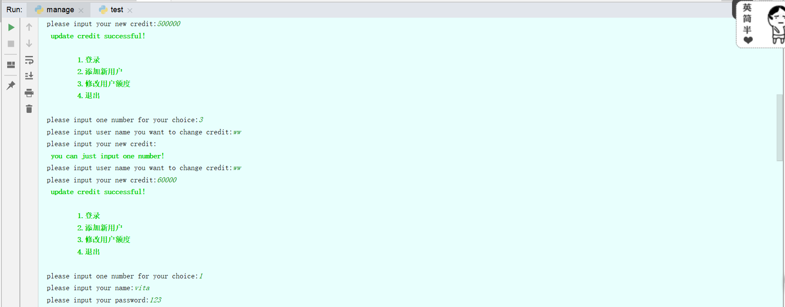

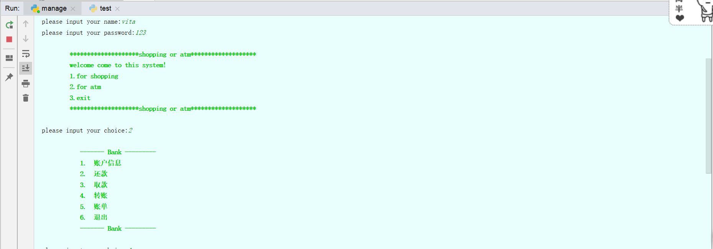
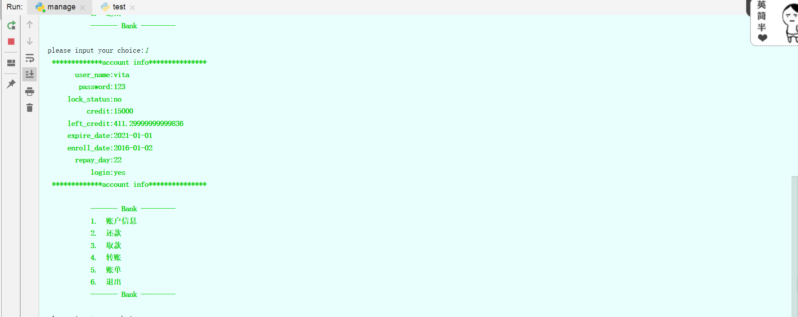
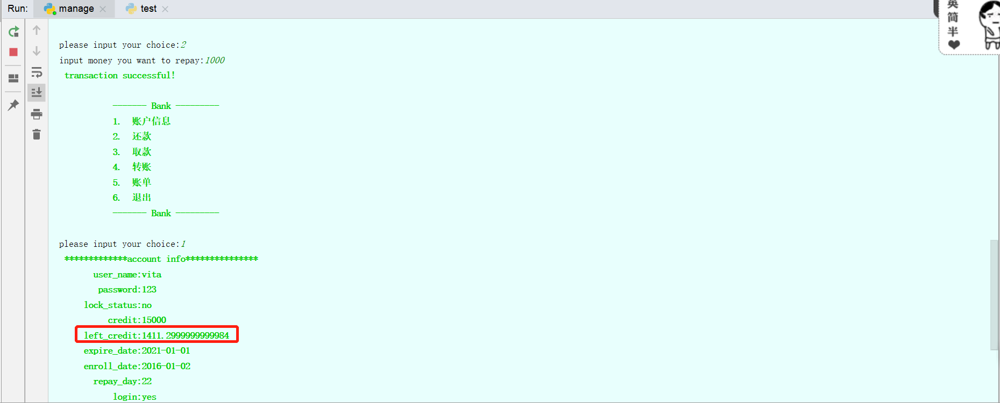
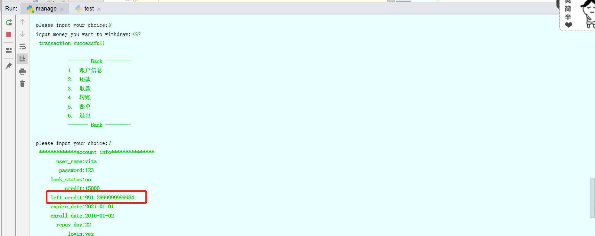


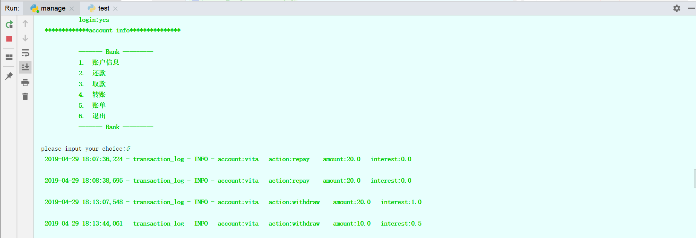

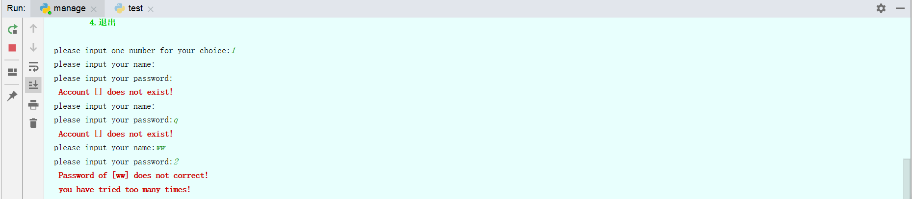


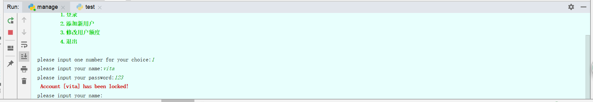
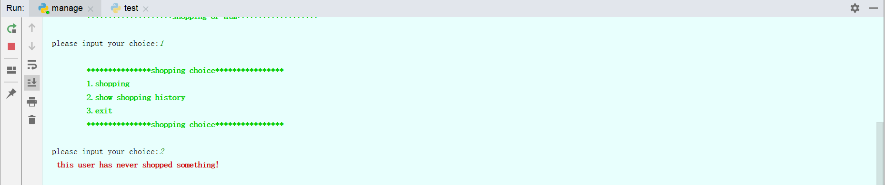
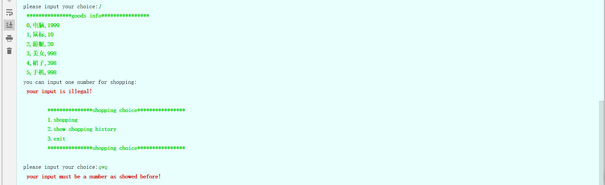

# 5.程序流程图
