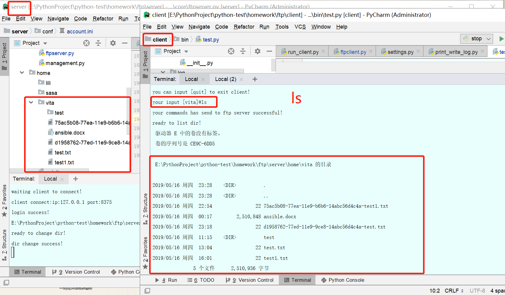
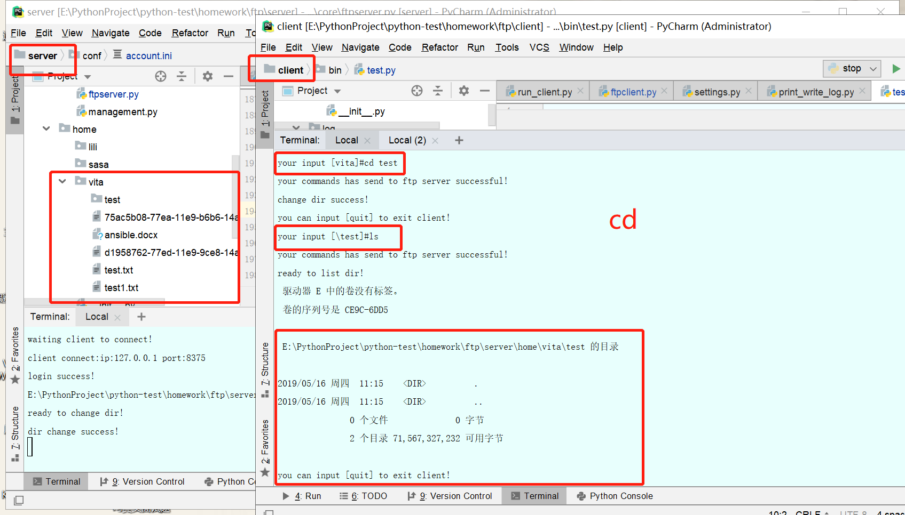
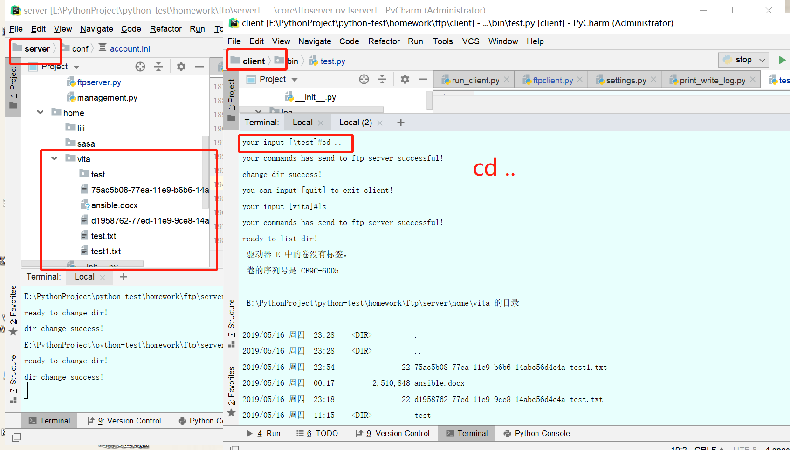
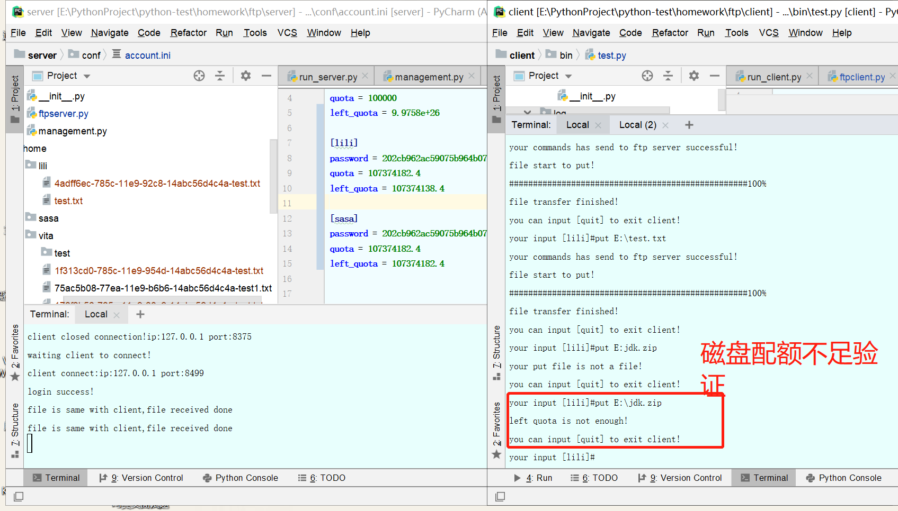
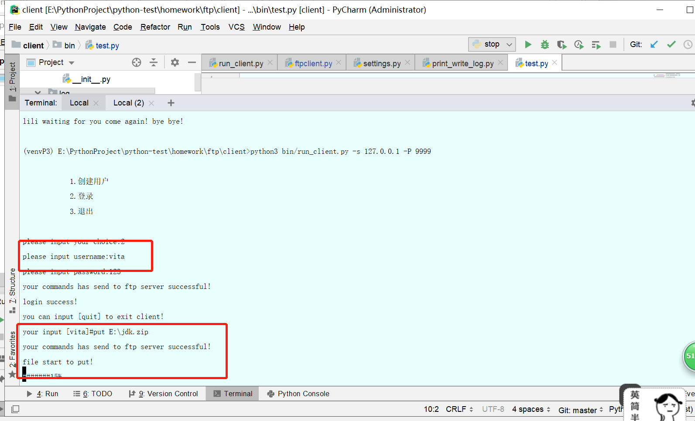
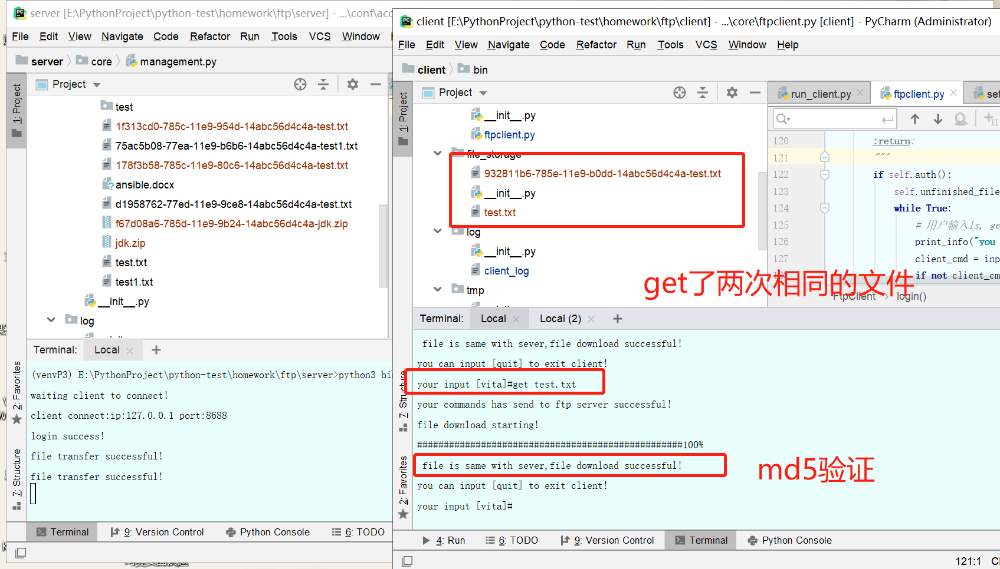
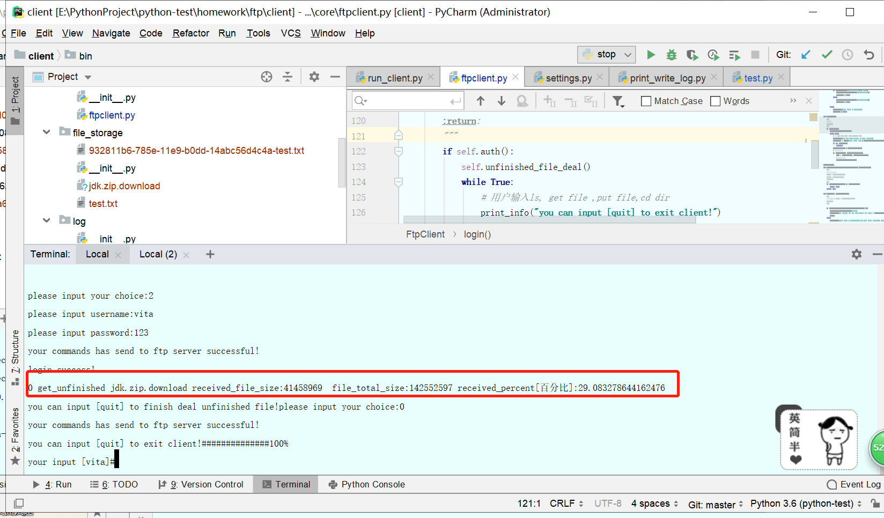
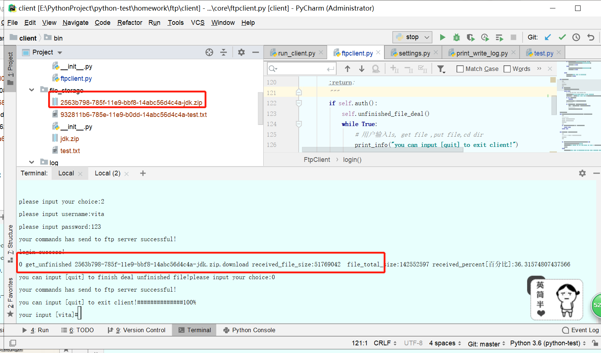
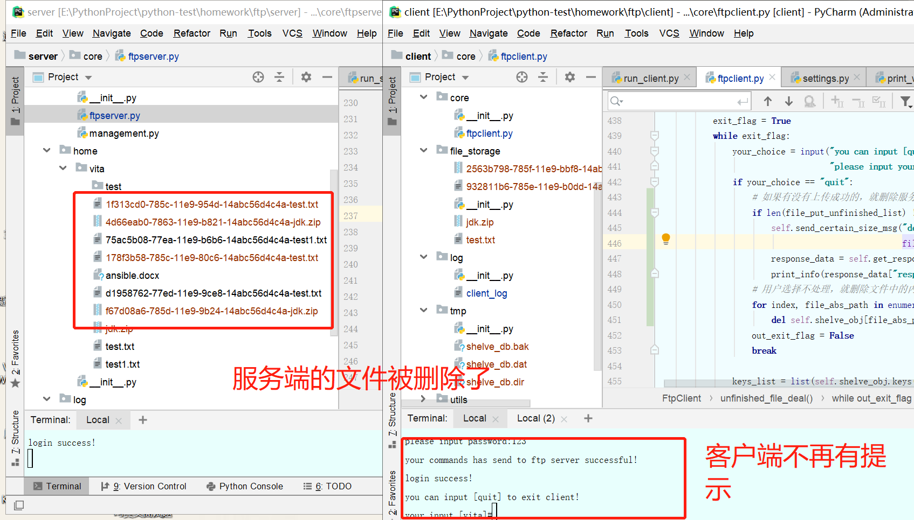

# 1.程序的实现的功能
```
基础需求：75%
1. 用户加密认证
2. 允许多用户登录
3. 每个用户都有自己的家目录，且只能访问自己的家目录
4. 对用户进行磁盘分配，每一个用户的可用空间可以自己设置
5. 允许用户在ftp server上随意切换目录
6. 允许用户查看自己家目录下的文件
7. 允许用户上传和下载，保证文件的一致性（md5）
8. 文件上传、下载过程中显示进度条

升级需求：10%
1. 文件支持断点续传
```
# 2.程序的启动方式
```
程序内的ls,杀死进程的命令主要使用于windows系统，目前使用windows10
python版本是3.6.2
首先-服务端启动
(venvP3) E:\PythonProject\python-test\homework\ftp\server>python3 bin/run_server.py start
waiting client to connect!

其次-客户端启动
(venvP3) E:\PythonProject\python-test\homework\ftp\client>python3 bin/run_client.py -s 127.0.0.1 -P 9999

            1.创建用户
            2.登录
            3.退出

# 创建一个新用户
please input your choice:1
please input new user name:lili
please set user password:123
please set user quota[G]:0.1G
your commands has send to ftp server successful!
user create success!

            1.创建用户
            2.登录
            3.退出

please input your choice:
please input your choice:2
# 登录
please input username:lili
please input password:123
your commands has send to ftp server successful!
login success!
you can input [quit] to exit client!
your input [lili]#

```
```
为了方便操作，这里还提供了了一个停止ftp所有服务的脚本，stop_ftp.py
直接运行，即可停止ftp_server和ftp_client
E:\PythonProject\python-test\venvP3\Scripts\python.exe E:/PythonProject/python-test/homework/ftp/stop_ftp.py
成功: 已终止 PID 8048 (属于 PID 104 子进程)的进程。

成功: 已终止 PID 3600 (属于 PID 856 子进程)的进程。


Process finished with exit code 1
```
# 3.登录用户信息
```
我创建的用户信息存在server/conf/account.ini中，密码为123
磁盘配额输入以G为单位，保存为字节，便于操作
```
# 4.程序运行效果






演示断点续传

这时执行stop_ftp.py，演示中断





重新登陆

断点get一个相同的文件



演示对未上传成功的文件，用户选择不处理


# 5.程序流程图
