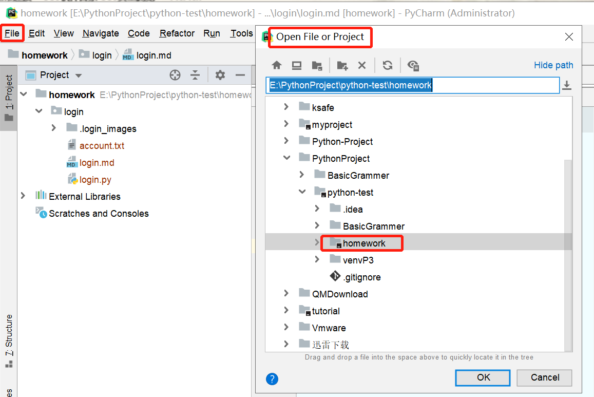
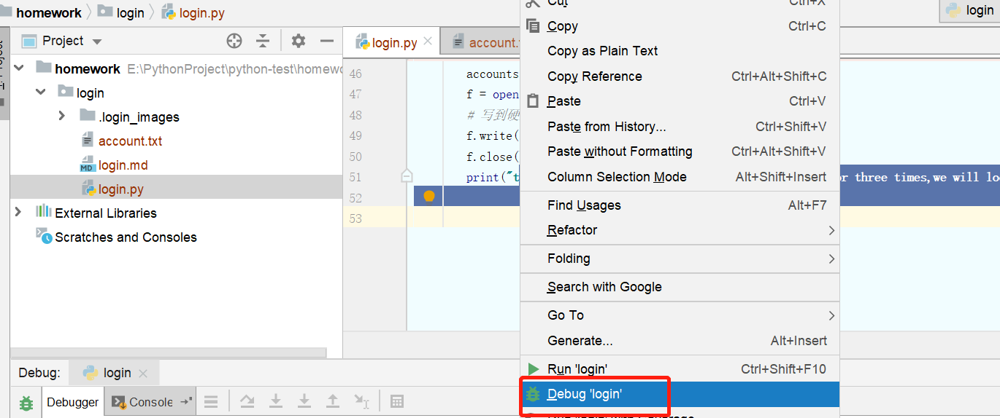
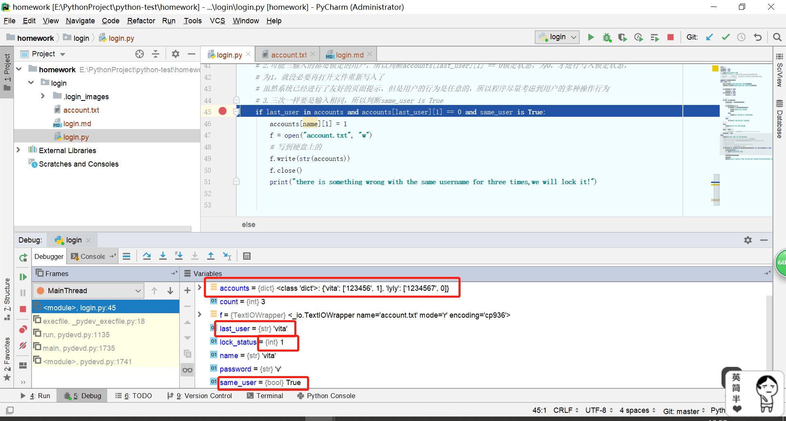
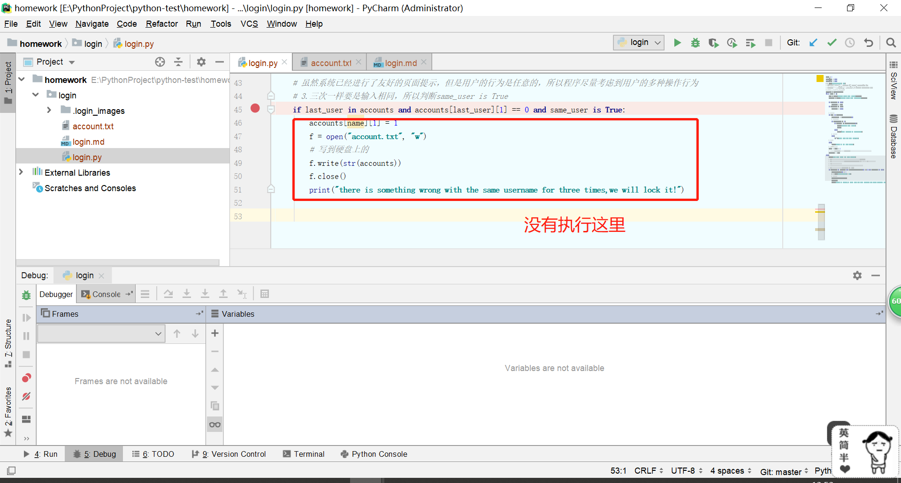
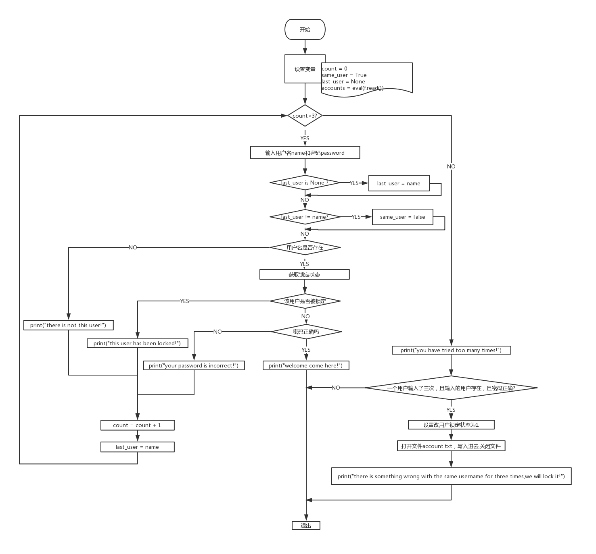

# 1.程序实现功能
```
1. 让用户输入用户名密码
2. 认证成功后显示欢迎信息、程序结束
3. 输错三次后退出程序
4. 可以支持多个用户登录 (提示：用户可以通过列表或者是字典进行存储)
5. 用户3次认证失败后，退出程序，再次启动程序尝试登录时，还是锁定状态（提示:需把用户锁定的状态存到文件里）
```
# 2. 程序启动方式


# 3.登录用户信息
```
{'vita': ['123456', 0], 'lyly': ['1234567', 0]}
字典的形式存储用户名，密码，和锁定状态信息
vita为用户名，是字典的key
['123456',0]是字典的值，123456是用户的密码，0是用户的锁定状态，0是没有锁定，1是锁定
这里存储了两个用户
```
# 4.程序运行效果

```
account.txt初始状态
{'vita': ['123456', 0], 'lyly': ['1234567', 0]}
D:\software2\Python3\install\python.exe E:/PythonProject/python-test/homework/login/login.py
please input your name:we --用户名不存在
please input your password:r
there is not this user!
please input your name:vita --密码不正确
please input your password:123
your password is incorrect!
please input your name:vita --用户名和密码正确
please input your password:123456
welcome come here!
```
用户名或密码带有空格
```
D:\software2\Python3\install\python.exe E:/PythonProject/python-test/homework/login/login.py
please input your name:我 --用户名为中文
please input your password:w
there is not this user!
please input your name:w     e  --中间含空格
please input your password:     --密码为空
there is not this user!
please input your name:lyly    --后面含空格  
please input your password:w
your password is incorrect!
you have tried too many times!

```
三次都不正确
```
D:\software2\Python3\install\python.exe E:/PythonProject/python-test/homework/login/login.py
please input your name:vita
please input your password:w
your password is incorrect!
please input your name:vita
please input your password:3
your password is incorrect!
please input your name:vita
please input your password:
your password is incorrect!
you have tried too many times!
there is something wrong with the same username for three times,we will lock it!
查看account.txt
{'vita': ['123456', 1], 'lyly': ['1234567', 0]}
```
三次输入的都是锁定用户
```
D:\software2\Python3\install\python.exe E:/PythonProject/python-test/homework/login/login.py
please input your name:vita
please input your password:i
this user has been locked!
please input your name:vita
please input your password:i
this user has been locked!
please input your name:vita
please input your password:k
this user has been locked!
you have tried too many times!
```



三次输入一样的不存在的用户名
```
D:\software2\Python3\install\python.exe E:/PythonProject/python-test/homework/login/login.py
please input your name:we  
please input your password:e
there is not this user!
please input your name:we
please input your password:q
there is not this user!
please input your name:we
please input your password:q
there is not this user!
```


# 5.程序流程图
