```
11，29题用到了case，when流程控制
26题用到了函数
27，29题新招数
41题方法二：自己写不出来
```
# 1.准备数据
```

##年级表
DROP TABLE IF EXISTS `class_grade`;
CREATE TABLE `class_grade` (
  `gid` int NOT NULL AUTO_INCREMENT,
  `gname` varchar(32) NOT NULL,
  PRIMARY KEY (`gid`)
) ENGINE=InnoDB COMMENT='年级表' CHARSET=utf8 AUTO_INCREMENT=1;

INSERT INTO `class_grade` VALUES ('1', '一年级'), ('2', '二年级'), ('3', '三年级'), ('4', '四年级');

##班级表
##索引grade_id
DROP TABLE IF EXISTS `class`;
CREATE TABLE `class` (
  `cid` int(11) NOT NULL AUTO_INCREMENT,
  `caption` varchar(32) NOT NULL,
  `grade_id` int NOT NULL,
  PRIMARY KEY (`cid`),
  KEY `fk_class_grade` (`grade_id`),
  CONSTRAINT `fk_class_grade` FOREIGN KEY (`grade_id`) REFERENCES `class_grade` (`gid`)
) ENGINE=InnoDB COMMENT='班级表' CHARSET=utf8;

INSERT INTO `class` VALUES ('1', '一年一班',1), ('2', '一年二班',1),('3', '二年一班',2),('4', '三年二班',3), ('5', '四年一班',4);

##学生表
##索引class_id
DROP TABLE IF EXISTS `student`;
CREATE TABLE `student` (
  `sid` int(11) NOT NULL AUTO_INCREMENT,
  `gender` char(1) NOT NULL,
  `class_id` int(11) NOT NULL,
  `sname` varchar(32) NOT NULL, 
  PRIMARY KEY (`sid`),
  KEY `fk_class` (`class_id`),
  CONSTRAINT `fk_class` FOREIGN KEY (`class_id`) REFERENCES `class` (`cid`)
) ENGINE=InnoDB COMMENT='学生表' CHARSET=utf8;
INSERT INTO `student` VALUES ('1', '男', '1', '理解'), ('2', '女', '1', '钢蛋'), ('3', '男', '1', '张三'), ('4', '男', '1', '张一'), ('5', '女', '1', '张二'), ('6', '男', '1', '张四'), ('7', '女', '2', '铁锤'), ('8', '男', '2', '李三'), ('9', '男', '2', '李一'), ('10', '女', '2', '李二'), ('11', '男', '2', '李四'), ('12', '女', '3', '如花'), ('13', '男', '3', '刘三'), ('14', '男', '3', '刘一'), ('15', '女', '3', '刘二'), ('16', '男', '3', '刘四');

##老师表
##索引
DROP TABLE IF EXISTS `teacher`;
CREATE TABLE `teacher` (
  `tid` int(11) NOT NULL AUTO_INCREMENT,
  `tname` varchar(32) NOT NULL,
  PRIMARY KEY (`tid`)
) ENGINE=InnoDB COMMENT='老师表' CHARSET=utf8;

INSERT INTO `teacher` VALUES ('1', '张三'), ('2', '李四'), ('3', '王五'), ('4', '朱六'), ('5', '赵七');

##课程表
##索引teacher_id
DROP TABLE IF EXISTS `course`;
CREATE TABLE `course` (
  `cid` int(11) NOT NULL AUTO_INCREMENT,
  `cname` varchar(32) NOT NULL,
  `teacher_id` int(11) NOT NULL,
  PRIMARY KEY (`cid`),
  KEY `fk_course_teacher` (`teacher_id`),
  CONSTRAINT `fk_course_teacher` FOREIGN KEY (`teacher_id`) REFERENCES `teacher` (`tid`)
) ENGINE=InnoDB COMMENT='课程表' CHARSET=utf8;


INSERT INTO `course` VALUES ('1', '生物', '2'), ('2', '物理', '1'), ('3', '体育', '3'), ('4', '美术', '1');

##成绩表
##索引student_id，course_id`
DROP TABLE IF EXISTS `score`;
CREATE TABLE `score` (
  `sid` int(11) NOT NULL AUTO_INCREMENT,
  `student_id` int(11) NOT NULL,
  `course_id` int(11) NOT NULL,
  `score` int(11) NOT NULL,
  PRIMARY KEY (`sid`),
  KEY `fk_score_student` (`student_id`),
  KEY `fk_score_course` (`course_id`),
  CONSTRAINT `fk_score_course` FOREIGN KEY (`course_id`) REFERENCES `course` (`cid`),
  CONSTRAINT `fk_score_student` FOREIGN KEY (`student_id`) REFERENCES `student` (`sid`)
) ENGINE=InnoDB COMMENT='成绩表' CHARSET=utf8;
INSERT INTO `score` VALUES ('1', '1', '1', '10'), ('2', '1', '2', '9'), ('5', '1', '4', '66'), ('6', '2', '1', '8'), ('8', '2', '3', '68'), ('9', '2', '4', '99'), ('10', '3', '1', '77'), ('11', '3', '2', '66'), ('12', '3', '3', '87'), ('13', '3', '4', '99'), ('14', '4', '1', '79'), ('15', '4', '2', '11'), ('16', '4', '3', '67'), ('17', '4', '4', '100'), ('18', '5', '1', '79'), ('19', '5', '2', '11'), ('20', '5', '3', '67'), ('21', '5', '4', '100'), ('22', '6', '1', '9'), ('23', '6', '2', '100'), ('24', '6', '3', '67'), ('25', '6', '4', '100'), ('26', '7', '1', '9'), ('27', '7', '2', '100'), ('28', '7', '3', '67'), ('29', '7', '4', '88'), ('30', '8', '1', '9'), ('31', '8', '2', '100'), ('32', '8', '3', '67'), ('33', '8', '4', '88'), ('34', '9', '1', '91'), ('35', '9', '2', '88'), ('36', '9', '3', '67'), ('37', '9', '4', '22'), ('38', '10', '1', '90'), ('39', '10', '2', '77'), ('40', '10', '3', '43'), ('41', '10', '4', '87'), ('42', '11', '1', '90'), ('43', '11', '2', '77'), ('44', '11', '3', '43'), ('45', '11', '4', '87'), ('46', '12', '1', '90'), ('47', '12', '2', '77'), ('48', '12', '3', '43'), ('49', '12', '4', '87'), ('52', '13', '3', '87');

##班级任职表
DROP TABLE IF EXISTS `teacher2cls`;
CREATE TABLE `teacher2cls` (
  `tcid` int(11) NOT NULL AUTO_INCREMENT,
  `tid` int(11) NOT NULL,
  `cid` int(11) NOT NULL,
  PRIMARY KEY (`tcid`),
  KEY `fk_score_student` (`tid`),
  KEY `fk_score_course` (`cid`),
  CONSTRAINT `fk_teacher2cls_teacher` FOREIGN KEY (`tid`) REFERENCES `teacher` (`tid`),
  CONSTRAINT `fk_teacher2cls_class` FOREIGN KEY (`cid`) REFERENCES `class` (`cid`)
) ENGINE=InnoDB COMMENT='班级任职表' CHARSET=utf8;
INSERT INTO `teacher2cls` VALUES ('1', '1', '1'),('2', '1', '2'),('3', '2', '1'),('4', '3', '2');

```
# 2、查询学生总人数；
```
select count(*) from student;
```

# 3、查询“生物”课程和“物理”课程成绩都及格的学生id和姓名；
```

select stu.sid,stu.sname,stu_score.score from student stu -- 我这里查询出了学生的id,姓名和成绩，便于查看
inner join 
(select * from score where course_id in -- 查询出所有学生的物理和生物的成绩大于等于60的
(select cid from course where cname in('生物','物理'))-- 查询出物理和生物的cid
and score>=60 )stu_score
on stu.sid=stu_score.student_id
```

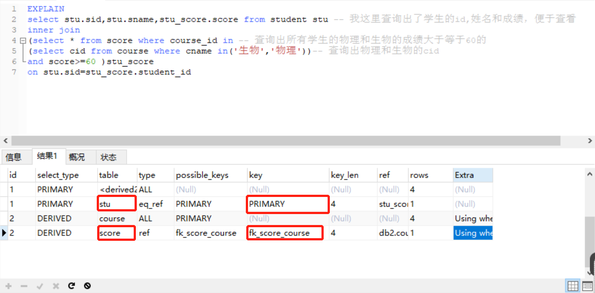
# 4、查询每个年级的班级数，取出班级数最多的前三个年级；
```
select gname,count(cid) count_cls  
from class cls 
inner join 
class_grade cls_gra
on cls.grade_id=cls_gra.gid  -- 查询出年级和班级的对应关系，由于我想列出年级名，所以和年级表关联一下，
                             -- 如果不想列出年级名，可直接使用班级表的grade_id分组
group by gname               -- 以谁分组，才能select哪个列(可以使用函数取其他列)，所以以gname分组
order by count_cls DESC      -- 由于order by执行顺序在sellect gname,count(cid) count_cls 之后，所以可以使用列别名
limit 3                      -- 只列出前三个年级

```
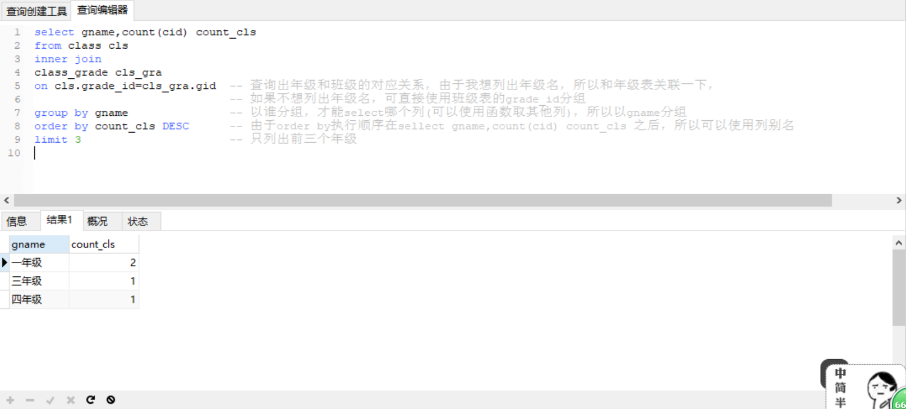
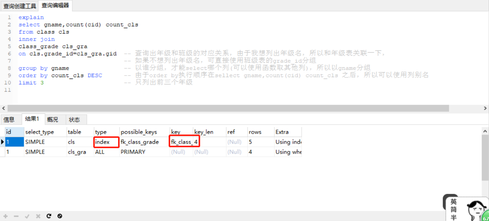
# 5、查询平均成绩最高和最低的学生的id和姓名以及平均成绩；
```
-- 查询平均成绩最高和最低的学生的id和姓名以及平均成绩；
select stu.sid,stu.sname,stu_avg_score.avg_score  -- 查询出学生id,姓名和平均成绩
from student stu 
inner join                      -- 主要是为了查询出学生姓名，才与student表关联
((select student_id,avg(score) avg_score 
from score 
group by student_id
order by avg_score desc limit 1 )-- 平均成绩最高的学生的ID和平均成绩
UNION                            -- union之后，是成绩最高和最低的两个学生信息
(select student_id,avg(score) avg_score 
from score 
group by student_id
order by avg_score asc limit 1 )) stu_avg_score -- 平均成绩最低的学生的ID和平均成绩
on stu.sid=stu_avg_score.student_id
```
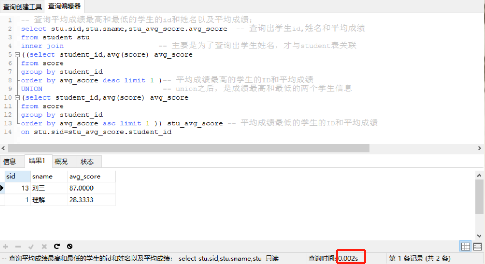

# 6、查询每个年级的学生人数；
```
-- 查询每个年级的学生人数；
-- 这里我使用了inner join，只列出有学生的班级，
-- 没有学生的班级count(*)后会为1，这样就有学生了
select gname,count(*) from student stu
inner join class cls
on stu.class_id=cls.cid
inner join class_grade cls_gra
on cls.grade_id=cls_gra.gid
group by gname  -- 这里按照gname分组，因为要列出gname
```


# 7、查询每位学生的学号，姓名，选课数，平均成绩；
```
-- 查询每位学生的学号，姓名，选课数，平均成绩；
select stu.sid,stu.sname,count(sco.course_id),avg(sco.score)  -- 这里我把列名前都加了表名，
                                                              -- 明确知晓该列在哪个表中
from student stu            -- 由于要列出学生姓名，所以与student表关联
inner join score sco
on stu.sid=sco.student_id
group by stu.sid,stu.sname  -- 这里按照多个列分组，这样才能在select时，列出该列
```


# 8、查询学生编号为“2”的学生的姓名、该学生成绩最高的课程名、成绩最低的课程名及分数；
```
-- 查询学生编号为“2”的学生的姓名、该学生成绩最高的课程名、成绩最低的课程名及分数
select sid,sname,stu_cor_sco.score,cor.cname from student  stu
inner join                   -- 与student表关联，获取学生姓名
((select student_id,course_id,score
from score 
where student_id=2 
order by score desc limit 1) -- 成绩最高的科
UNION                        -- union之后，就是该学生成绩最高和最低的信息的两条数据
(select student_id,course_id,score
from score 
where student_id=2 
order by score asc limit 1))stu_cor_sco -- 成绩最低的科
on stu.sid=stu_cor_sco.student_id
inner join course cor       -- 与course课程表关联，获取课程名
on stu_cor_sco.course_id=cor.cid
```


# 9、查询姓“李”的老师的个数和所带班级数；
```
-- 查询姓“李”的老师的个数和所带班级数；
-- 我这里是算出所有李老师教的总班级数
select count(distinct tname) count_teacher ,count(cid) count_course
 from teacher tech  -- 由于需要使用老师的名字，所以使用老师表 
inner join teacher2cls t2c  -- 这张表对应着老师教授的班级

on tech.tid=t2c.tid
where tname like '李%'  -- 李老师可能教了很多个班级，所以使用count(distinct tname)找出老师数
                        -- count(cid)由于cid是不重复的，所以直接计算，可算出所有李老师教的总班级数

```
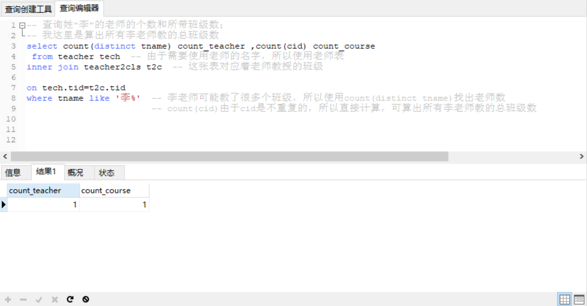
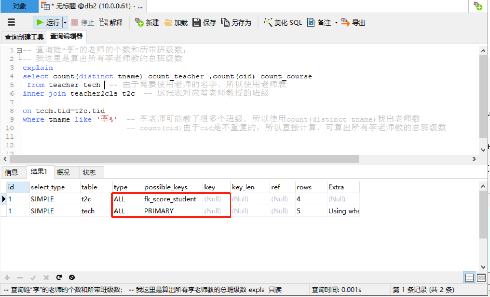
# 10、查询班级数小于5的年级id和年级名；
```
-- 查询班级数小于5的年级id和年级名
-- 查询出一个年级中，所有班级少于5个的年级id和年级名
select cls_gra.gid,cls_gra.gname,count(*)  -- 这里我把班级数也列了出来
from class cls
inner join class_grade cls_gra  -- 因为要查出年级名，所以要是用年级表
on cls.grade_id=cls_gra.gid
group by cls_gra.gid,cls_gra.gname  -- 因为要列出年级id和年级名，所以要以这两个分组
having count(*)<5                  -- 班级数少于5个，
                        -- 由于按照年级分组，每个年级中的班级是不重复的，所以使用count(*)
```

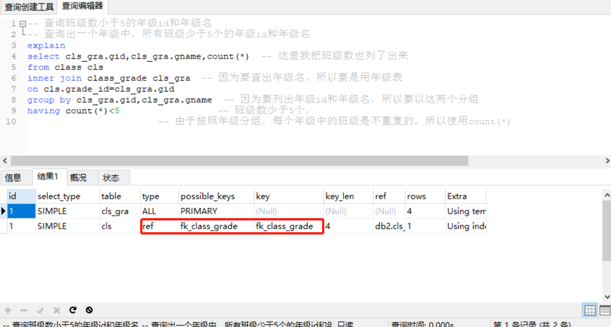
# 11、查询班级信息，包括班级id、班级名称、年级、年级级别(12为低年级，34为中年级，56为高年级)，示例结果


```
-- 查询班级信息，包括班级id、班级名称、年级、年级级别(12为低年级，34为中年级，56为高年级)
select cls.cid,cls.caption,cls_gra.gname,
case 
when cls_gra.gid between 1 and 2 then '低年级'
when cls_gra.gid between 3 and 4 then '中年级'
when cls_gra.gid between 5 and 6 then '高年级'
end as 'grade_level'  -- 设置列别名
from class cls inner join class_grade cls_gra
on cls.grade_id=cls_gra.gid
```


# 12、查询学过“张三”老师2门课以上的同学的学号、姓名；
```
-- 查询学过“张三”老师2门课以上的同学的学号、姓名
select score.student_id,student.sname from score 
inner join student   -- 由于要列出学生姓名，需要与student表关联
on score.student_id=student.sid
where course_id in    -- 找出学了张三老师课的学生
(select course.cid from course inner join teacher
on course.teacher_id=teacher.tid
where teacher.tname='张三')     -- 找出张三老师教的课,cid 为2,4

group by score.student_id,student.sname -- 按照学生分组，每个学生组中的课程id是唯一的
having count(*)>=2                      -- 所以count(*)就是每个学生的课程数
                   -- 由于张三老师只教了两门课，生物和体育，所以这里就>=2才有结果
```
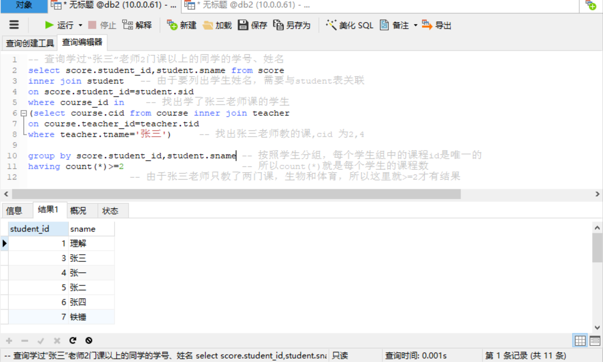
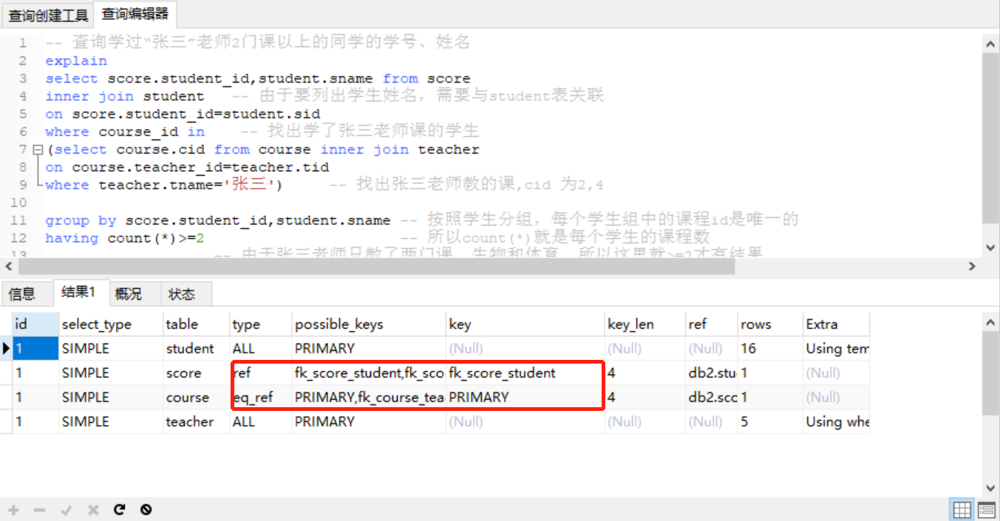
# 13、查询教授课程超过2门的老师的id和姓名；
```
-- 查询教授课程超过2门的老师的id和姓名
-- 表中数据只有张三老师教了两门，别的老师都只是教了一门，所以这里>=2才有结果显示，就不>2了
select teacher.tid,teacher.tname
from course inner join teacher      -- 要显示老师姓名，所以需要join teacher表
on course.teacher_id=teacher.tid
group by teacher.tid,teacher.tname   -- 由于要列出老师id和姓名，所以要把这两列加到分组中
having count(cname)>=2          -- 根据老师分组，每个老师组中的课程是唯一的，这里可以使用
                                -- count(*)或count(cid)或count(cname)
```

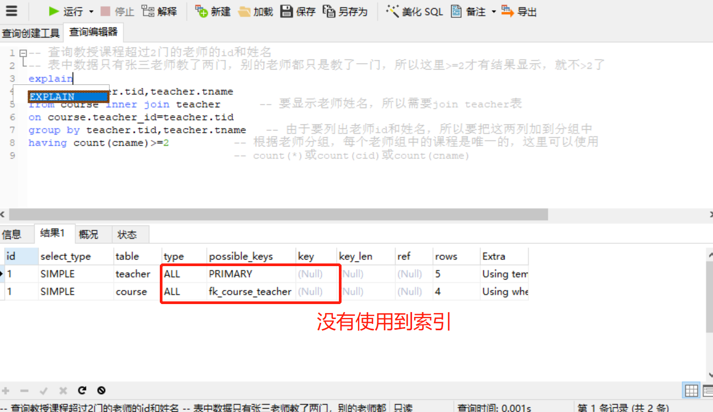
# 14、查询学过编号“1”课程和编号“2”课程的同学的学号、姓名；
```
-- 查询学过编号“1”课程和编号“2”课程的同学的学号、姓名
select student.sid,student.sname
from score inner join student
on score.student_id=student.sid
where course_id in (1,2)  -- 查询counse_id为(1,2)的学生学号，姓名
group by student.sid,student.sname   -- 按照学生来分组，查询学过
having count(course_id)=2        -- 查询学过两门课程的学生，因为可能有的学生只学习过一门
```


# 15、查询没有带过高年级的老师id和姓名；
```
-- 查询没有带过高年级的老师id和姓名
-- grade id =5或6为高年级
select tea.tid,tea.tname
from teacher tea left  join teacher2cls t2c
on tea.tid=t2c.tid
left  join class cls
on t2c.cid=cls.cid
where grade_id is null or grade_id not in (5,6)
-- 可能有的老师没有教班级，在学校中做别的事
-- grade_id not in (5,6)会排除掉为null的值
```


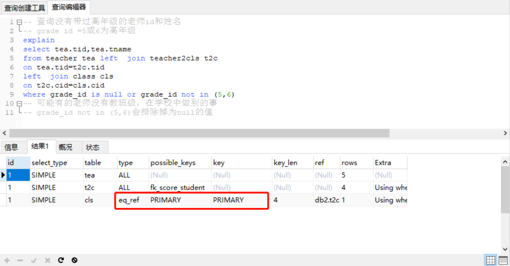
# 16、查询学过“张三”老师所教的所有课的同学的学号、姓名；
```
-- 查询学过“张三”老师所教的所有课的同学的学号、姓名
select student.sid,student.sname from student inner join score
on student.sid=score.student_id
where score.course_id in    -- 查询出学习了张三老师课的学生
(select cid from course inner join teacher
on course.teacher_id=teacher.tid
where teacher.tname='张三')  -- 查询张三老师教的课,course_id 为2,4
group by student.sid,student.sname
having count(score.course_id)=                  -- 在学习过张三老师课的学生中，找出所有课都学过的学生
(select count(*) from course inner join teacher -- 这里是查询出张三老师教过几门课
on course.teacher_id=teacher.tid
where teacher.tname='张三')   

```
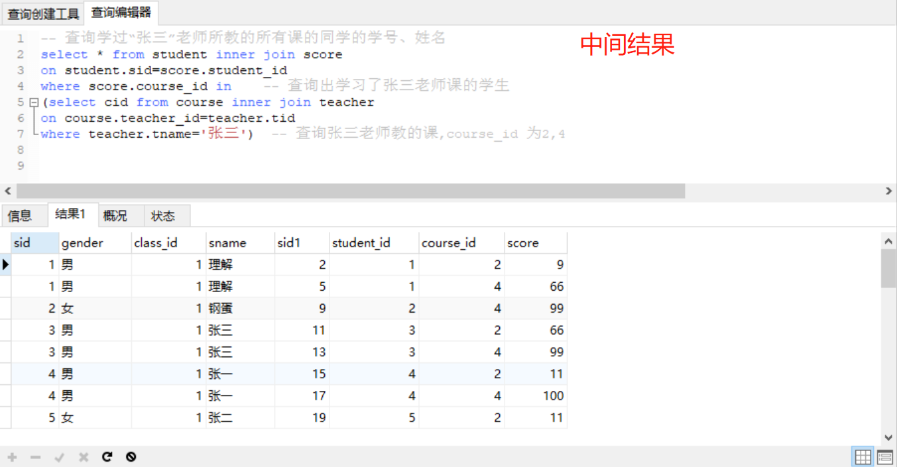
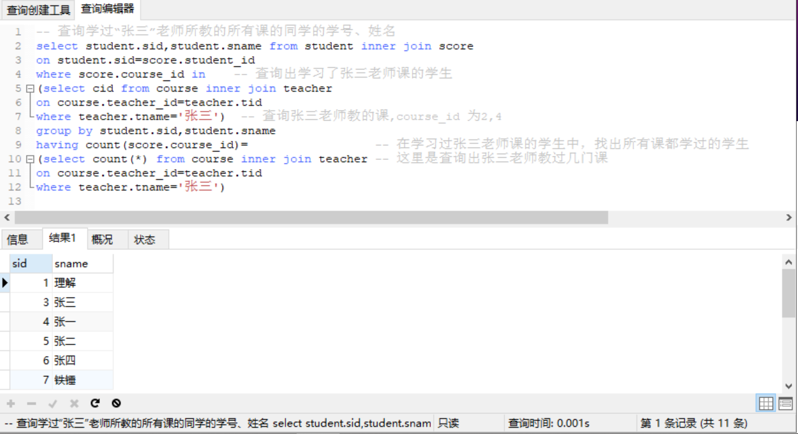
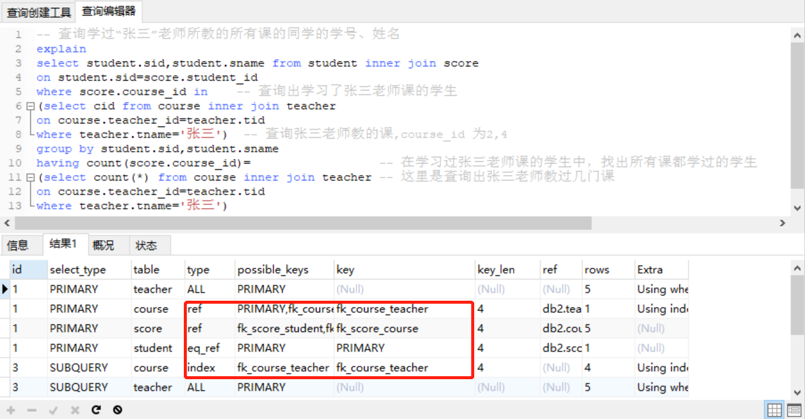
# 17、查询带过超过2个班级的老师的id和姓名；
```
-- 查询带过超过2个班级的老师的id和姓名
select tea.tid,tea.tname
from teacher tea inner join teacher2cls t2c
on tea.tid=t2c.tid
group by tea.tid,tea.tname -- 由于要列出老师的id,和姓名，所以要以这两列分组，只有在分组中的列才能select查询
having count(cid)>=2 -- 由于我这里没有老师带过超过两个班级，我这里就没用>2,就使用>=2来显示结果
```
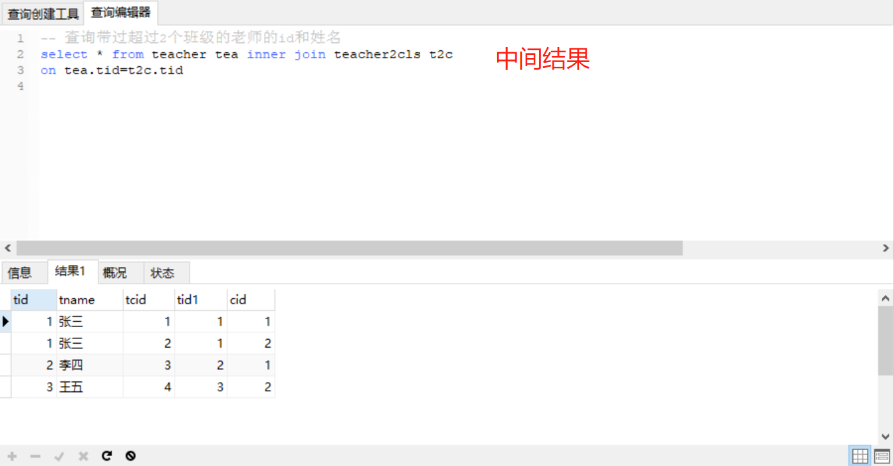


# 18、查询课程编号“2”的成绩比课程编号“1”课程低的所有同学的学号、姓名；
```
-- 查询课程编号“2”的成绩比课程编号“1”成绩低的所有同学的学号、姓名
select stu.sid,stu.sname
from student stu inner join 
(select score score1,student_id  from score where course_id=1)score1_info-- 查询出所有学生课程编号1的成绩
on stu.sid=score1_info.student_id
inner join 
(select score score2,student_id from score where course_id=2)score2_info-- 查询出所有学生课程编号2的成绩
on score1_info.student_id=score2_info.student_id
where score1_info.score1>score2_info.score2  -- 筛选出课程1成绩>课程2成绩的学生
```

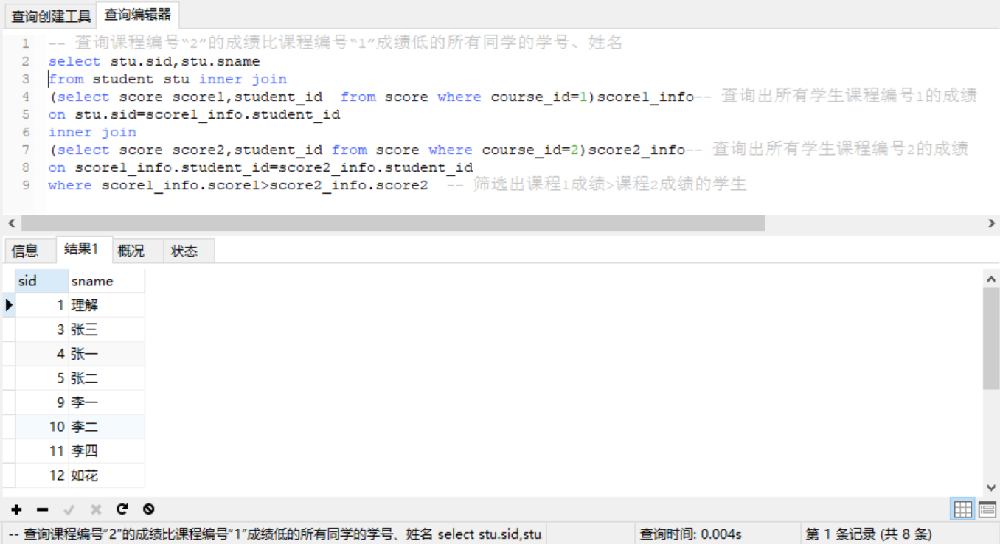

# 19、查询所带班级数最多的老师id和姓名；
```
-- 查询所带班级数最多的老师id和姓名
select tea.tid,tea.tname,count(t2c.cid) count_cid
from teacher tea inner join teacher2cls t2c
on tea.tid=t2c.tid
group by tea.tid,tea.tname      -- 按照老师的id和姓名分组
order by count_cid desc limit 1 -- 查询带班级数最多的一个老师
                                -- 由于order by的执行顺序在select后，所以这里可以使用列别名
```


```
做到目前为止，已经有近10个题目用到了老师的名字，所以给teacher.tname创建一个索引
create index tname_index on teacher(tname);
```
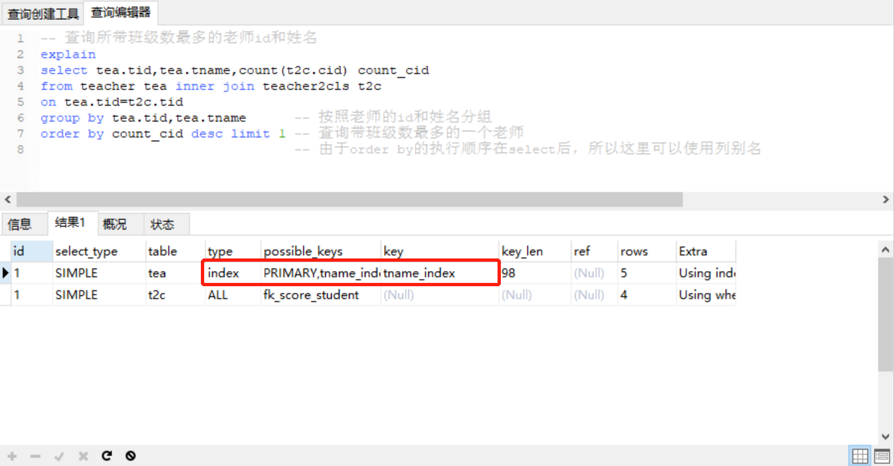
# 20、查询有课程成绩小于60分的同学的学号、姓名；
```
-- 查询有课程成绩小于60分的同学的学号、姓名
select student.sid,student.sname 
from student inner join score
on student.sid=score.student_id
where score<60   -- 查询成绩小于60的所有学生
group by student.sid,student.sname  -- 由于上面有重复的学生id和名字，所以通过group by分组，取出魅族的第一个
```
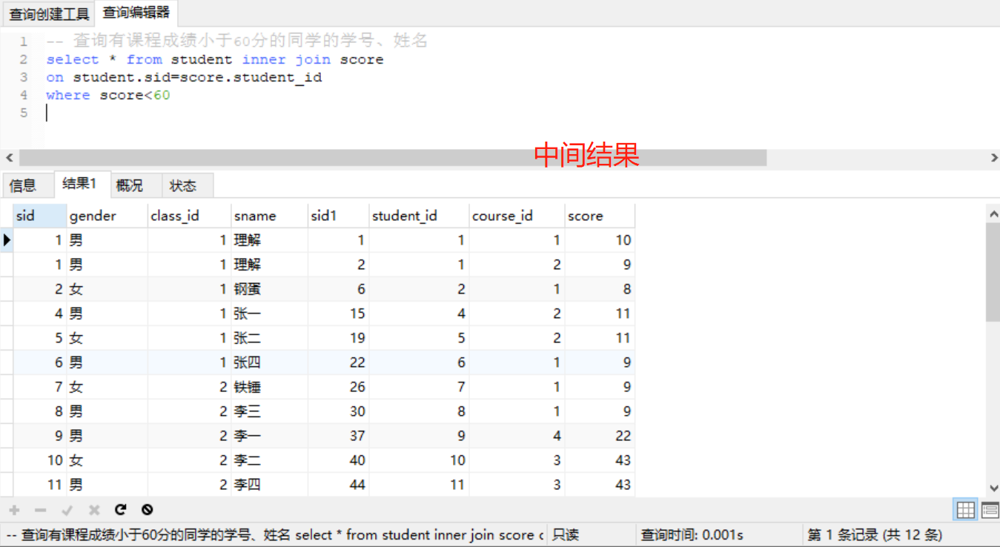

```
由于多处用到了sname,这里为sname也创建一个索引
create index sname_index on student(sname);
```
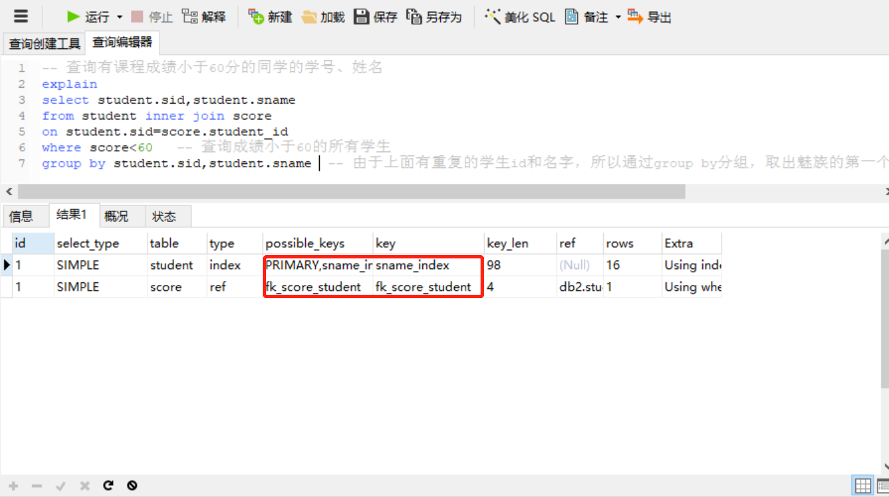
# 21、查询没有学全所有课的同学的学号、姓名；
```
-- 查询没有学全所有课的同学的学号、姓名
-- 没有选课的学生排出在外了
select student.sid,student.sname from student inner join score
on student.sid=score.student_id
group by student.sid,student.sname  -- 按照学生分组
having count(score.course_id)<(select count(*) from course)-- 学生有成绩的课程数<总课程数的学生
```

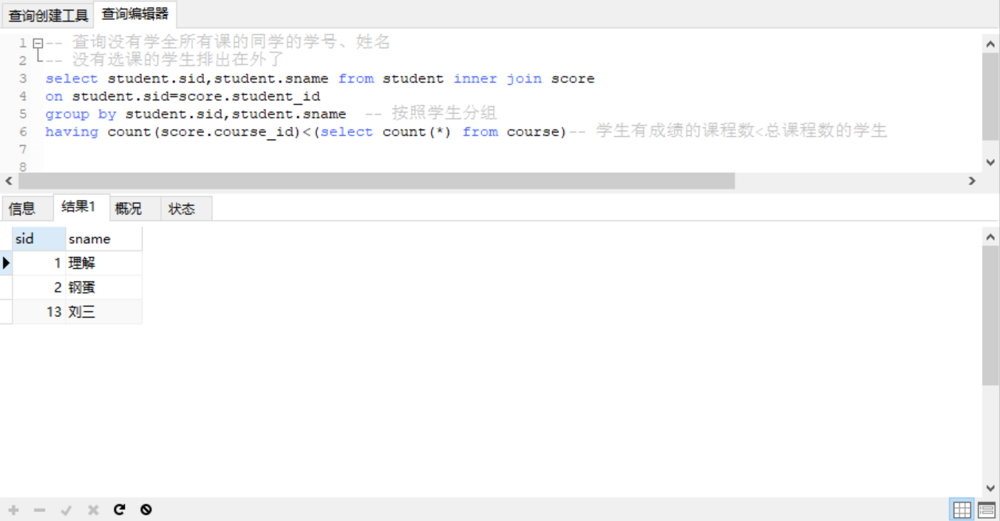
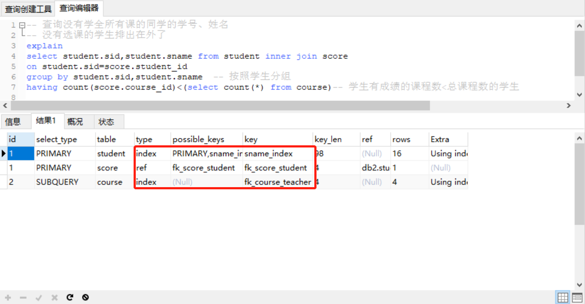
# 22、查询至少有一门课与学号为“1”的同学所学相同的同学的学号和姓名；
```
-- 查询至少有一门课与学号为“1”的同学所学相同的同学的学号和姓名
-- 包含学号为1的学生本人
select student.sid,student.sname 
from student inner join score
on student.sid=score.student_id
where score.course_id in   -- 查询学了学号为1的学生的课的其他学生信息
(select course_id from score where student_id=1)-- 查询出学号为1的学生所学的课
group by student.sid,student.sname  -- 按照学生来分组，由于查出的学生和ID是有重复的，分组后只查询出一条
```


# 23、查询至少学过学号为“1”同学所选课程中任意一门课的其他同学学号和姓名；
```
-- 查询至少有一门课与学号为“1”的同学所学相同的同学的学号和姓名
select student.sid,student.sname 
from student inner join score
on student.sid=score.student_id
where score.course_id in   -- 查询学了学号为1的学生的课的其他学生信息
(select course_id from score where student_id=1)-- 查询出学号为1的学生所学的课
and student.sid != 1  -- 去掉学号为1的学生本人
group by student.sid,student.sname  -- 按照学生来分组，由于查出的学生和ID是有重复的，分组后只查询出一条
```


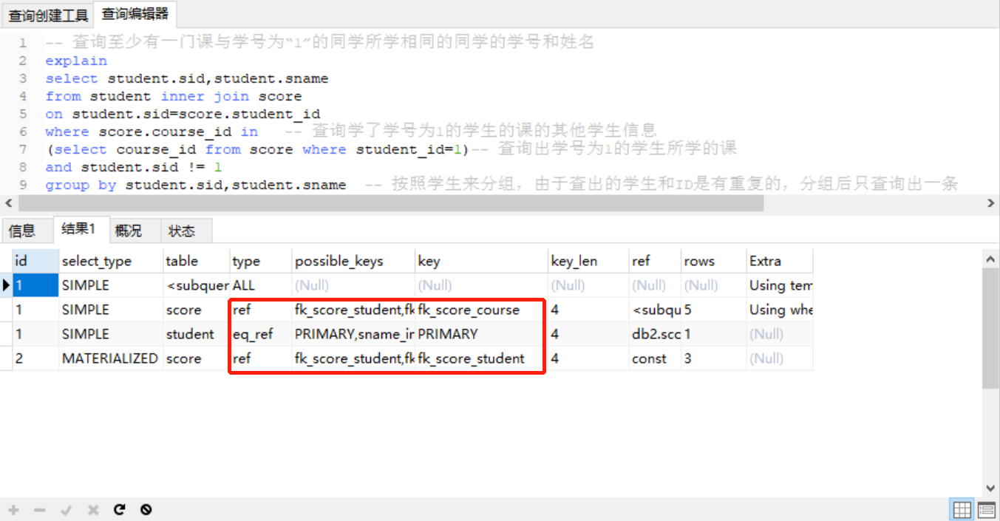
# 24、查询和“2”号同学学习的课程完全相同的其他同学的学号和姓名；
```
-- 查询和“2”号同学学习的课程完全相同的其他同学的学号和姓名
select student.sid,student.sname 
from student inner join score
on student.sid=score.student_id
where score.course_id in    -- 查询学习了2号学生课程的其他学生信息
(select course_id from score where student_id=2) -- 查询出二号学生学的课程
and score.student_id != 2  -- 排出2号学生本人
group by student.sid,student.sname  -- 按照学生id和姓名分组
having count(course_id)=(select count(*) from score where student_id=2)-- 课程数与2号学生所学课程数相同
```

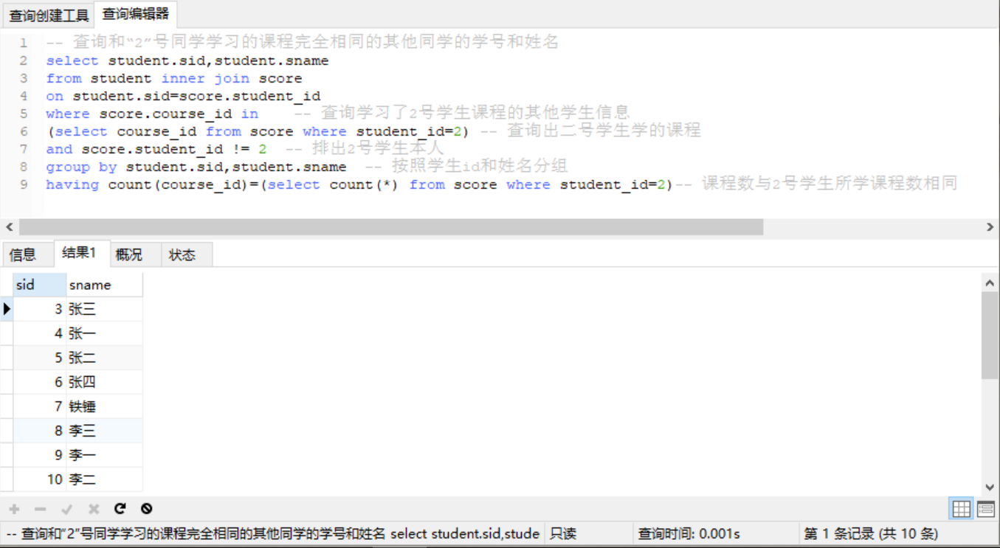
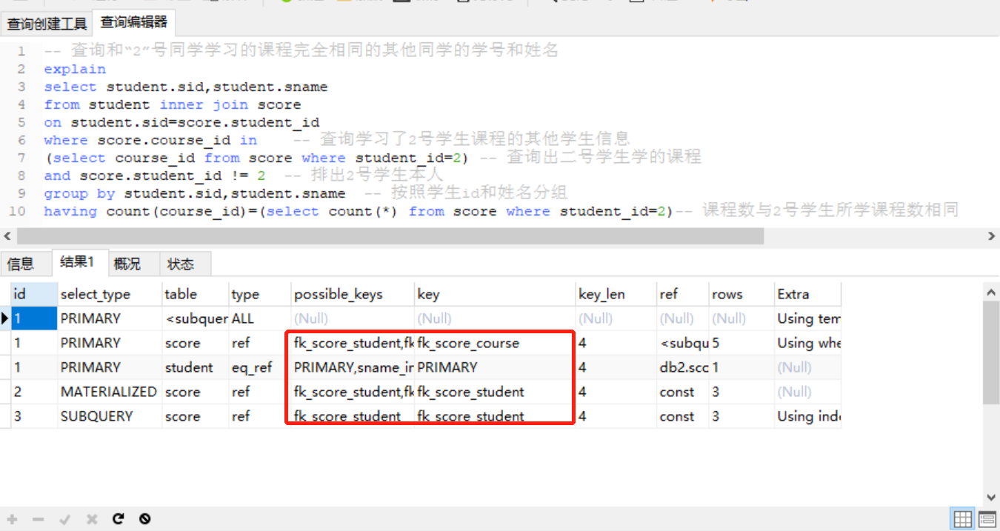
# 25、删除学习“张三”老师课的score表记录；
```
-- 删除学习“张三”老师课的score表记录
delete from score where score.course_id in -- 删除学习了张三老师课的score记录
(select course.cid from course inner join teacher
on course.teacher_id=teacher.tid
where teacher.tname='张三')  -- 查询张三老师教了课的课程id
```
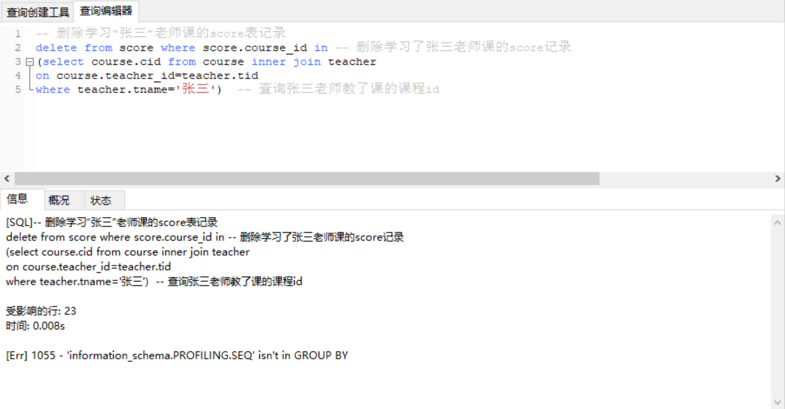
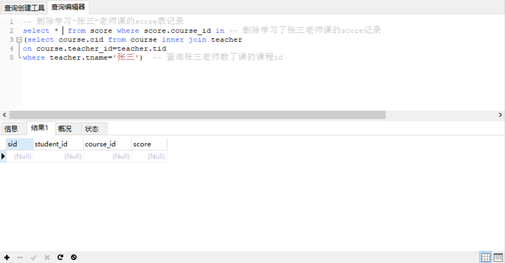
# 26、向score表中插入一些记录，这些记录要求符合以下条件：①没有上过编号“2”课程的同学学号；②插入“2”号课程的平均成绩；
```

-- 26、向score表中插入一些记录，这些记录要求符合以下条件
-- ①没有上过编号“2”课程的同学学号；②插入“2”号课程的平均成绩；
INSERT INTO score(student_id, course_id, score)
SELECT t1.sid, '2' AS cid, t2.avg_score  -- 插入的数据，cid全为2
FROM 
    (SELECT student.sid
    FROM student LEFT JOIN score ON student.sid = score.student_id
    WHERE course_id != 2 OR course_id is null
    group by student.sid) AS t1, -- 由于这里查询出的数据可能有重复，通过group by去重
    (SELECT IFNULL(AVG(score), 0) as 'avg_score'
    FROM score
    WHERE course_id = '2') AS t2
ORDER BY sid


```

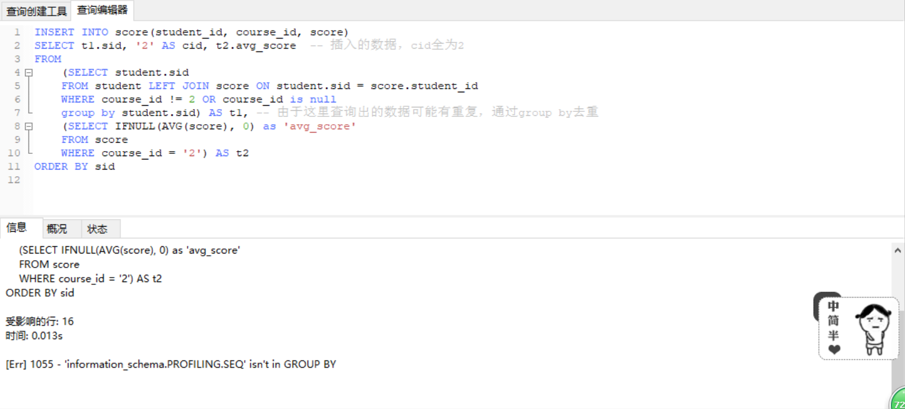
# 27、按平均成绩从低到高显示所有学生的“语文”、“数学”、“英语”三门的课程成绩，按如下形式显示： 学生ID,语文,数学,英语,课程数和平均分；
```
"1.方法一：存在缺陷"
-- 按平均成绩从低到高显示所有学生的“语文”、“数学”、“英语”三门的课程成绩，
-- 按如下形式显示： 学生ID,语文,数学,英语,课程数和平均分
-- 由于这里没有语文，数据，英语，这里使用 “生物，物理，体育"
-- 这里 学生1号没有学体育，这样join之后，后面的列全部为0了
select SW.student_id,IFNULL(sw,0)sw,IFNULL(wl,0)wl,IFNULL(ty,0)ty,IFNULL(course_count,0)course_count,IFNULL(avg_score,0)avg_score from
-- 每个学生生物的成绩
(select student_id,score as sw from score  inner join course on score.course_id=course.cid where cname='生物')SW
left join 
-- 每个学生物理的成绩
(select student_id,score as wl from score  inner join course on score.course_id=course.cid where cname='物理')WL
on SW.student_id=WL.student_id
left join
-- 每个学生体育的成绩
(select student_id,score as ty from score  inner join course on score.course_id=course.cid where cname='体育')TY
on WL.student_id=TY.student_id
left join
-- 每个学生的课程数
(select student_id,count(course_id) course_count from score group by student_id)COURSE_COUNT
on TY.student_id=COURSE_COUNT.student_id
left join
-- 每个学生的所有课程的平均成绩
(select student_id,avg(score) avg_score from score group by student_id)AVG_SCORE
on COURSE_COUNT.student_id=AVG_SCORE.student_id
order by avg_score asc

"2.有效方法"
SELECT
        sc.student_id,
        IFNULL((select score.score from score left join course on score.course_id = course.cid where course.cname = '体育' and score.student_id = sc.student_id),0) as yw,
        IFNULL((select score.score from score left join course on score.course_id = course.cid where course.cname = '生物' and score.student_id = sc.student_id),0) as sx,
        IFNULL((select score.score from score left join course on score.course_id = course.cid where course.cname = '体育' and score.student_id = sc.student_id),0) as yy,
        COUNT(sc.course_id),
        AVG(sc.score)
FROM score AS sc
GROUP BY sc.student_id
ORDER BY avg(sc.score) ASC;
```


# 28、查询各科成绩最高和最低的分：以如下形式显示：课程ID，最高分，最低分；
```
-- 查询各科成绩最高和最低的分：以如下形式显示：课程ID，最高分，最低分
-- 这里我们只从score表中查，没有在score表中的科目我们就不管了，实际情况根据用户需求定
select course_id,max(score),min(score) from score group by course_id
```


# 29、按各科平均成绩从低到高和及格率的百分数从高到低顺序；
```
-- 按各科平均成绩从低到高和及格率的百分数从高到低顺序；
select course_id,avg(score) avg_score,
(select count(*) from score s where  s.course_id=sco.course_id and s.score>=60)/
(select count(*) from score s where s.course_id=sco.course_id) percent   -- 根据27题的方法算出每个course_id的合格率
from score sco
group by course_id -- sql语句执行顺序，先执行group by,然后执行select 
order by avg_score asc,percent desc  -- 按照平均成绩升序，及格率降序

"方法二"
select course_id,avg(score) avg_score,
		sum(case when score.score>60 then 1 else 0 end)/count(1)*100 as percent
from
		score
group by
		course_id
order by
		avg_score asc,
		percent desc;
```
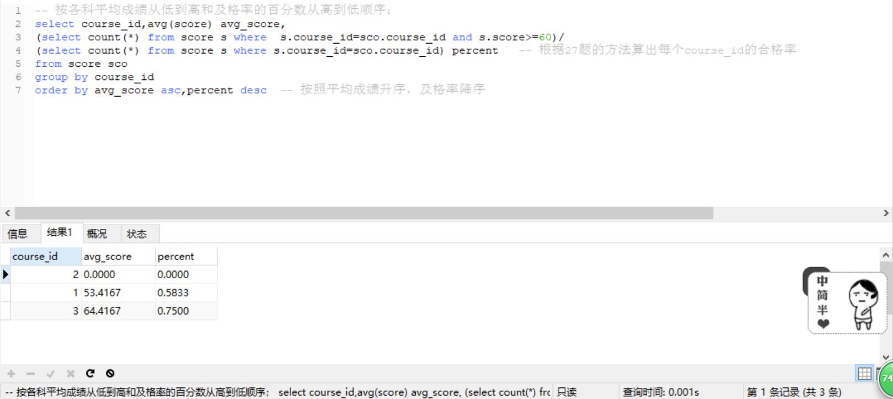


# 30、课程平均分从高到低显示（显示任课老师）；
```
-- 课程平均分从高到低显示（显示任课老师）
select course.cid,avg(score.score) avg_score ,teacher.tname
from score inner join course
on score.course_id=course.cid
inner join teacher
on course.teacher_id=teacher.tid
group by course.cid,teacher.tname -- 由于要显示老师名，所以加到了group by里
order by avg_score desc          -- .注意，这里可能一个老师教多个课程，但是按照(course.cid,teacher.tname)两个加在一起分组
                                 -- 两列值相同才是同一组
```
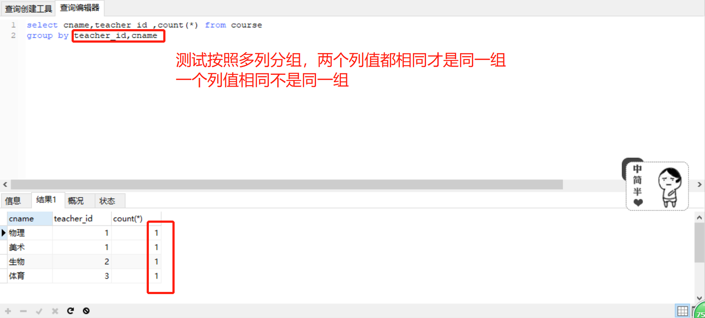

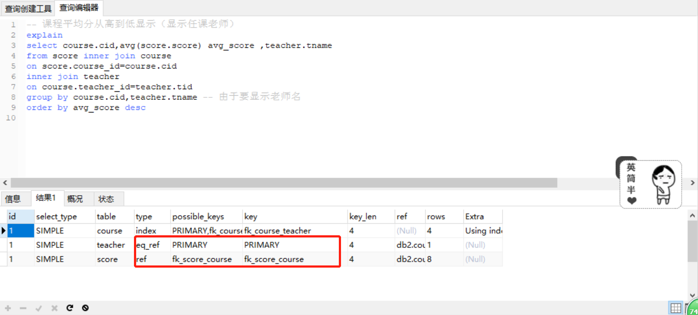
# 31、查询各科成绩前三名的记录(不考虑成绩并列情况) ；
```
-- 查询各科成绩前三名的记录(不考虑成绩并列情况)
select sco.course_id,
(select score from score where score.course_id=sco.course_id order by score desc limit 1)firt_score,-- 按成绩降序第一条
(select score from score where score.course_id=sco.course_id order by score desc limit 1,1)second_score,-- 按成绩降序第二条
(select score from score where score.course_id=sco.course_id order by score desc limit 2,1)third_score -- 按成绩降序第三条
from score sco
group by sco.course_id
```


# 32、查询每门课程被选修的学生数；
```
-- 查询每门课程被选修的学生数
select course.cid,count(sid) from course -- 这里不能使用count(*),因为有一行就是一条数据，没有学生选课时，count(*)为0是不对的
left join score-- 因为有的课程没有被学生选择，所以使用left join
on course.cid=score.course_id
group by course.cid
```
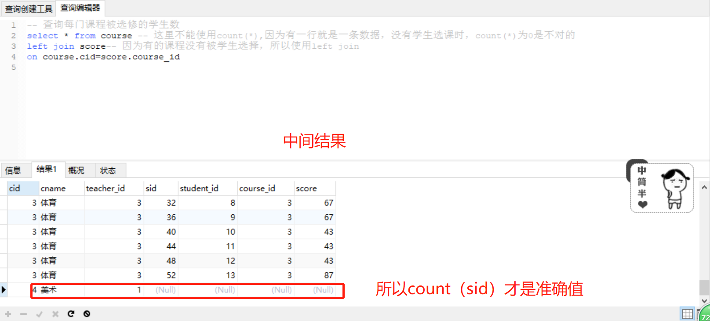

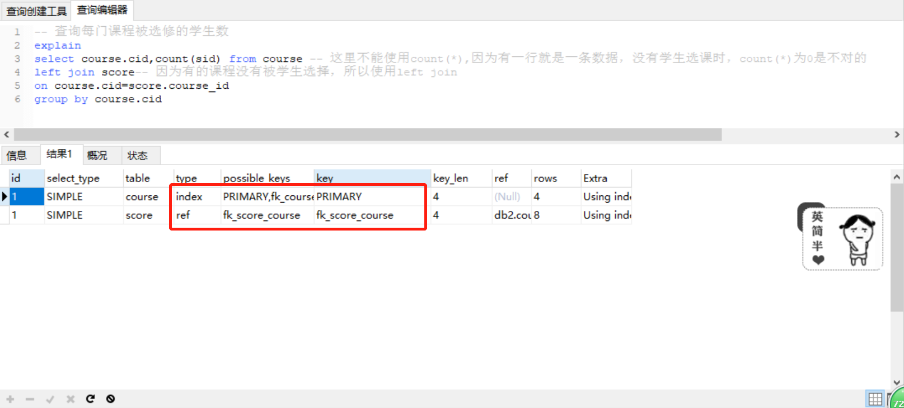
# 33、查询选修了2门以上课程的全部学生的学号和姓名；
```
-- 查询选修了2门以上课程的全部学生的学号和姓名
select student.sid,student.sname,count(score.course_id) 
from student left join score 
on student.sid=score.student_id
group by student.sid,student.sname -- 按照学生id和名字分组，因为要列出这两个列
having count(score.course_id)>2 -- 这里使用count(score.course_id)比较准确，因为可能有的学生没有成绩，为null
```

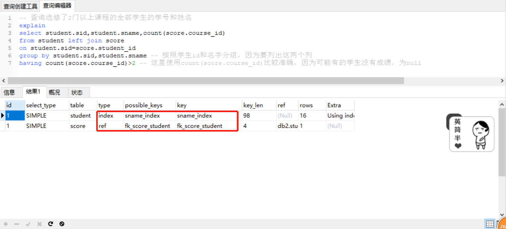
# 34、查询男生、女生的人数，按倒序排列；
```
-- 查询男生、女生的人数，按倒序排列
select gender,count(sid) person_num 
from student group by gender 
order by person_num desc
```

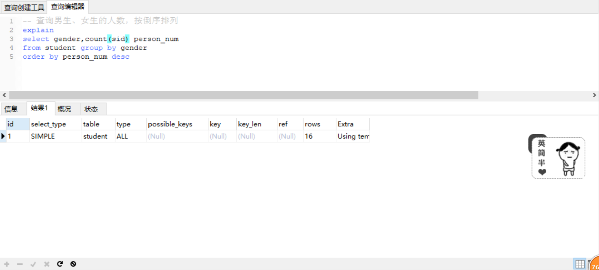
# 35、查询姓“张”的学生名单；
```
-- 查询姓“张”的学生名单
select * from student where sname like '张%'
```
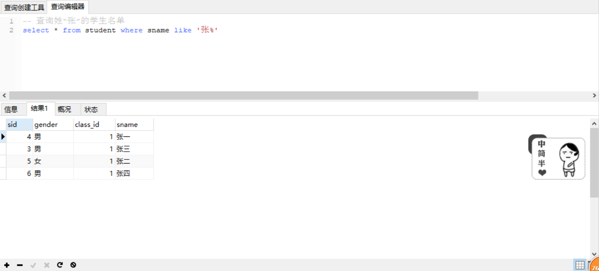
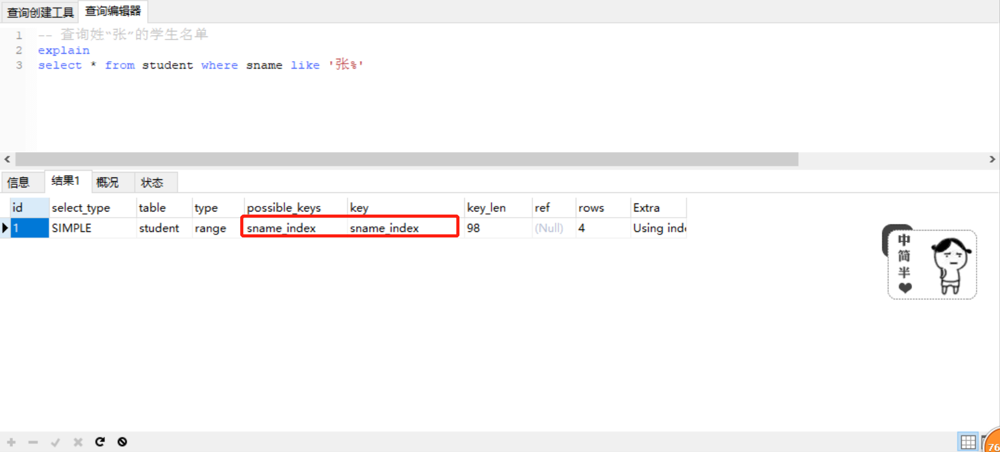
# 36、查询同名同姓学生名单，并统计同名人数；
```
-- 查询同名同姓学生名单，并统计同名人数
explain
select sname,count(*) 
from student 
group by sname 
having count(*)>=2-- 按照学生名字分组，每组中>=2条数据
```

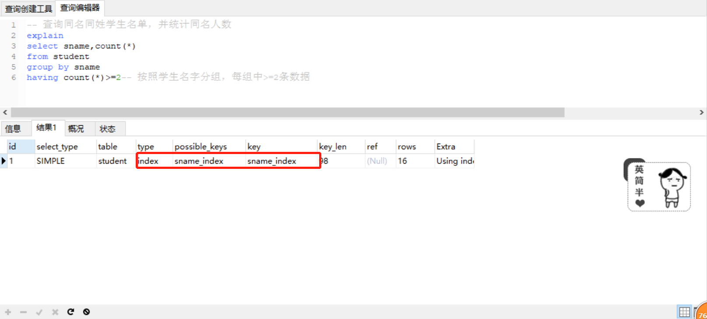
# 37、查询每门课程的平均成绩，结果按平均成绩升序排列，平均成绩相同时，按课程号降序排列；
```
-- 查询每门课程的平均成绩，结果按平均成绩升序排列，平均成绩相同时，按课程号降序排列；
select  course.cid,IFNULL(avg(score.score),0) avg_score -- 这里吧课程表也加入进来，可能有的课程没有学生选
from course left join score
on score.course_id=course.cid
group by course.cid   -- 要按照course.cid分组，不能按照score.course_id分组，因为course表中的课程才是最全的
order by avg_score asc,course.cid desc
```
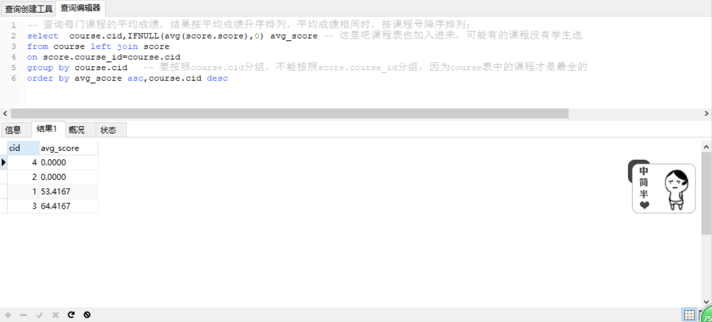

# 38、查询课程名称为“数学”，且分数低于60的学生姓名和分数；
```
-- 查询课程名称为“数学”，且分数低于60的学生姓名和分数
-- 没有数学，我这里以生物来显示数据
select student.sname,score.score 
from student left join score
on student.sid=score.student_id
left join course 
on score.course_id=course.cid   -- 由于需要学生名，课程名，成绩，所以需要三张表
where course.cname='生物' and score.score<60
```

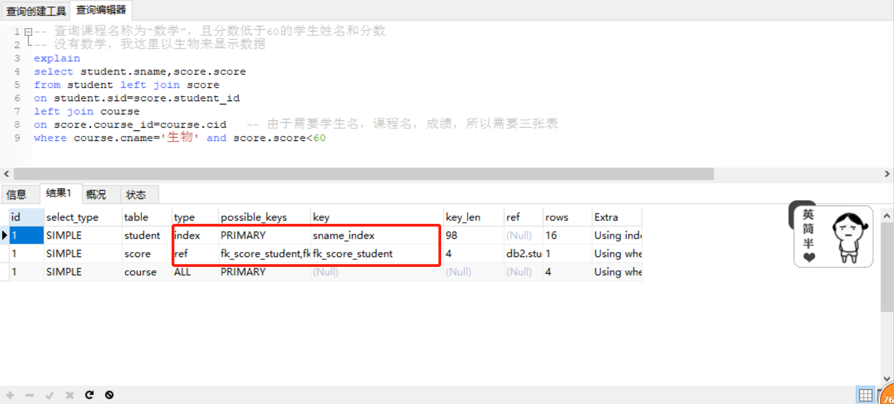
# 39、查询课程编号为“3”且课程成绩在80分以上的学生的学号和姓名；
```
-- 查询课程编号为“3”且课程成绩在80分以上的学生的学号和姓名
select student.sid,student.sname 
from student left join score
on student.sid=score.student_id  -- 由于需要学生姓名和成绩，所以需要学生表和成绩表
where score.course_id=3 and score.score>80
```
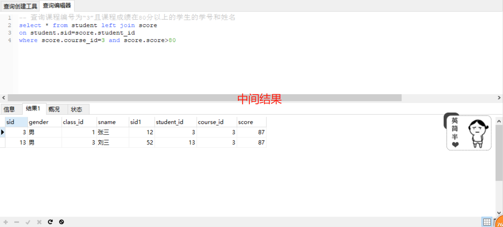
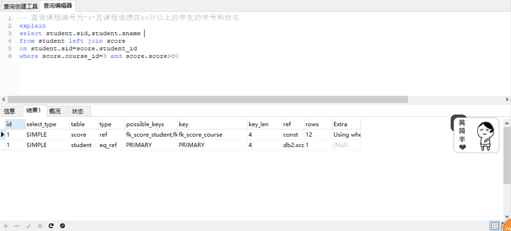
# 40、求选修了课程的学生人数
```
-- 求选修了课程的学生人数
select count(distinct student.sid)  -- 由于一个学生可能学了多个课程，所以学生姓名首重复的
from student left join score
on student.sid=score.student_id
where score.course_id is not null  -- 可能有的学生没有选课，则course_id为null
```


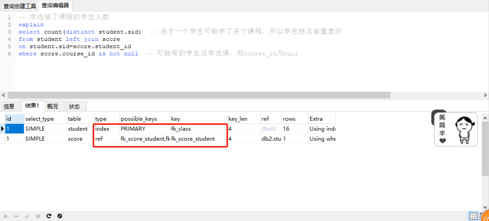
# 41、查询选修“王五”老师所授课程的学生中，成绩最高和最低的学生姓名及其成绩；
```
-- 查询选修“王五”老师所授课程的学生中，成绩最高和最低的学生姓名及其成绩
-- 王五老师没有学生，这里假设李四
(select student.sname,score.score from student left join score
on student.sid=score.student_id
left join course
on score.course_id=course.cid
left join teacher
on course.teacher_id=teacher.tid
where teacher.tname='李四'
order by score.score desc limit 1) -- 成绩最高的学生信息
union
(select student.sname,score.score from student left join score
on student.sid=score.student_id
left join course
on score.course_id=course.cid
left join teacher
on course.teacher_id=teacher.tid
where teacher.tname='李四'
order by score.score asc limit 1) -- 成绩最低的信息


-- 查询选修“王五”老师所授课程的学生中，成绩最高和最低的学生姓名及其成绩
-- 王五老师没有学生，这里假设李四
select student.sid,student.sname,t2.course_id,t2.score,t2.max_score,t2.min_score from student
                inner join (
                    select score.student_id,score.course_id,score.score,t1.max_score,t1.min_score
                        from score,
                        (
                        select course_id,max(score) as max_score,min(score) as min_score
                        from score
                        where course_id in (
                            select cid from course
                            inner join teacher on course.teacher_id = teacher.tid
                        where teacher.tname = '李四'
                        )
                    group by course_id
                    ) as t1
                where score.course_id = t1.course_id
                    and score.score in(
                        max_score,
                        min_score
                    )
                    
                )as t2 on student.sid  = t2.student_id;
```

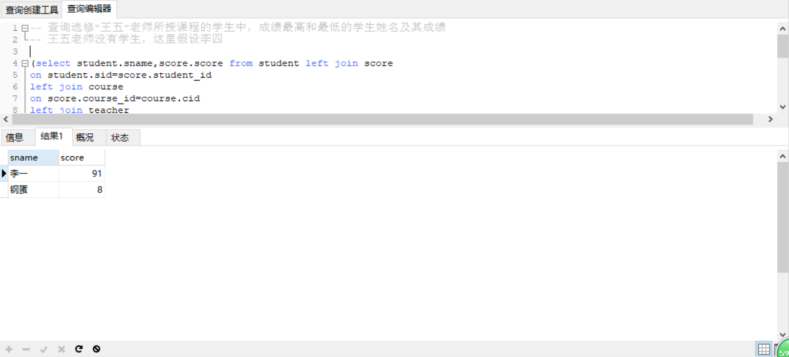

# 42、查询各个课程及相应的选修人数；
```
-- 查询各个课程及相应的选修人数
select course.cid,count(score.student_id) student_count -- 有的course没有学生，所以count(score.student_id)才是准确的
from course left join score  -- 由于要查每个课程，所以使用course left join,取course表中所有数据
on course.cid=score.course_id
group by course.cid  -- 按照课程分组
```
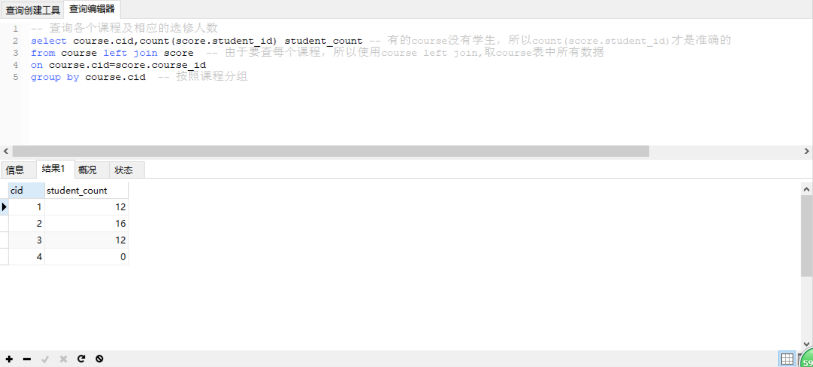
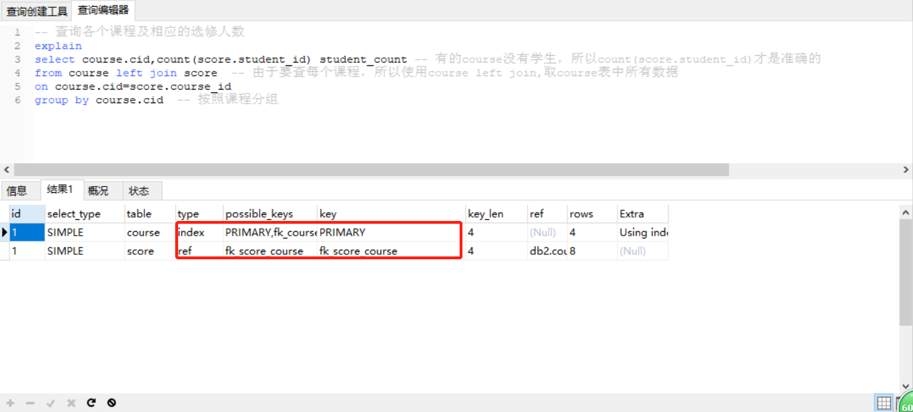
# 43、查询不同课程但成绩相同的学生的学号、课程号、学生成绩；
```
-- 查询不同课程但成绩相同的学生的学号、课程号、学生成绩
select score1.student_id,score1.course_id,score1.score 
from score score1 inner join score score2
on score1.sid=score2.sid
where score1.score=score2.score -- 查询出成绩相同的信息
and score1.course_id != score2.course_id -- 课程不同
```
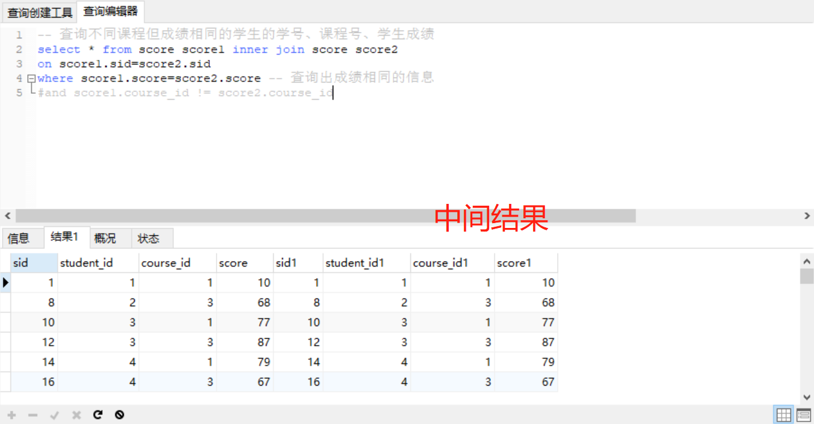
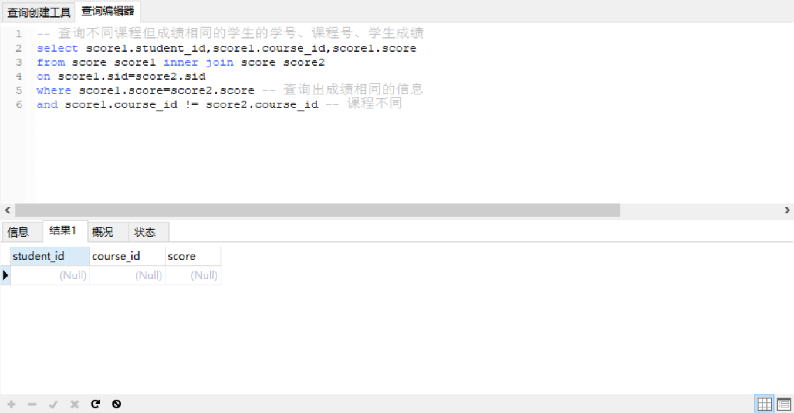

# 44、查询每门课程成绩最好的前两名学生id和姓名；
```
-- 查询每门课程成绩最好的前两名学生id和姓名
select sco.course_id,
-- 按照成绩排序，不管成绩是否相同，取第一个
(select student_id from score where score.course_id=sco.course_id order by score desc limit 1) max_student_id,
-- 根据上面取出的学生id,查学生名字
(select sname from student where sid=max_student_id)max_student_name,
-- 按照成绩排序，不管成绩是否相同，取第二个
(select student_id from score where score.course_id=sco.course_id order by score desc limit 2,1) second_student_id,
-- 根据上面取出的学生id,查学生名字
(select sname from student where sid=second_student_id)second_student_name
from score sco group by sco.course_id-- 这里我们只取有学生选的课程的信息，所以只从score表中取了
-- sql的执行顺序是限制性group by,然后执行select中的选项，所以在select中可以使用sco.course_id
```


# 45、检索至少选修两门课程的学生学号；
```
-- 检索至少选修两门课程的学生学号 
select score.student_id,count(score.course_id)   -- 只让显示学号，所以只用score表就可以了
from  score
group by score.student_id -- 按照学生分组，看每个学生的选课书
having count(score.course_id)>=2-- 这里是按照学生分组，课程数>=2
```
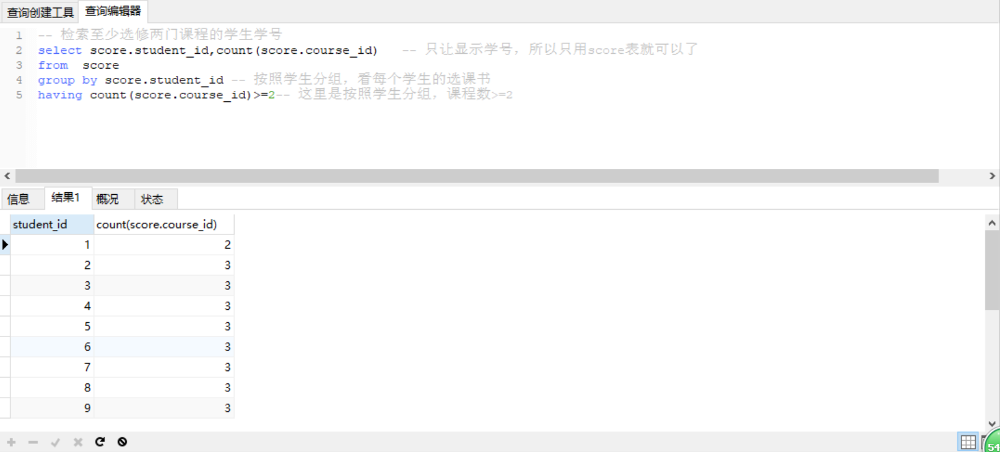
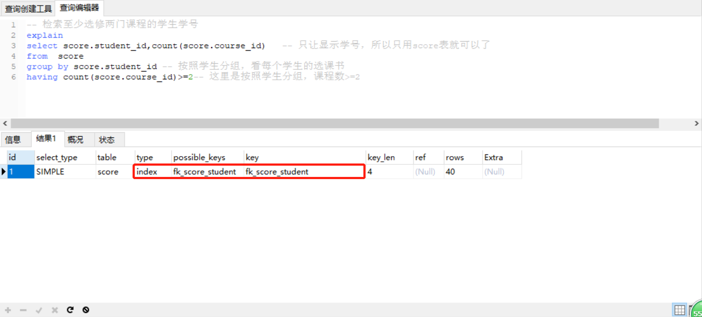
# 46、查询没有学生选修的课程的课程号和课程名；
```
-- 查询没有学生选修的课程的课程号和课程名
select course.cid,course.cname 
from course left join score
on course.cid=score.course_id
where score.student_id is null  -- 没有学生选修的课，student_id为null
group by course.cid,course.cname
```
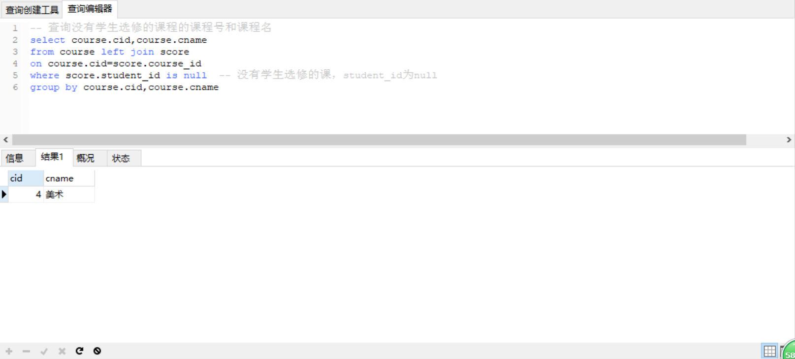

# 47、查询没带过任何班级的老师id和姓名；
```
-- 查询没带过任何班级的老师id和姓名
select teacher.tid,teacher.tname 
from teacher left join teacher2cls -- 需要老师的姓名，所以需要老师表
on teacher.tid=teacher2cls.tid
where teacher2cls.cid is null-- 没带过课的老师，teacher2cls.cid为Null
```


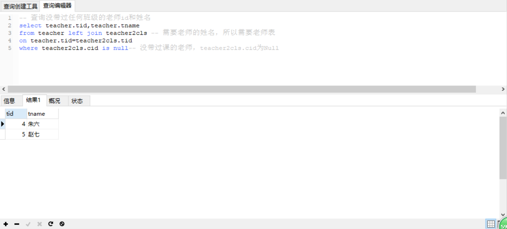

# 48、查询有两门以上课程超过80分的学生id及其平均成绩；
```
-- 查询有两门以上课程超过80分的学生id及其平均成绩
select student_id,avg(score) from score where score>80 -- 先找到超过80分的学生信息
group by student_id
having count(1)>2   -- 按照学生分组，每组中>2
```
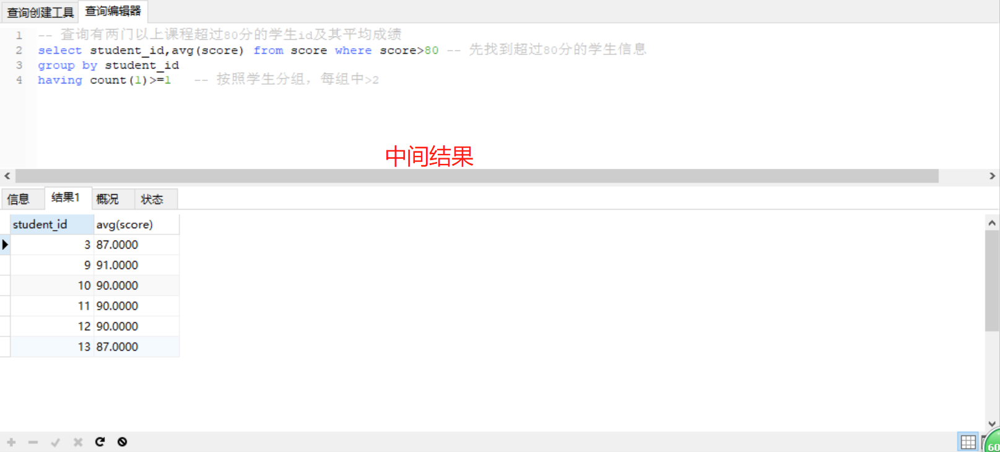
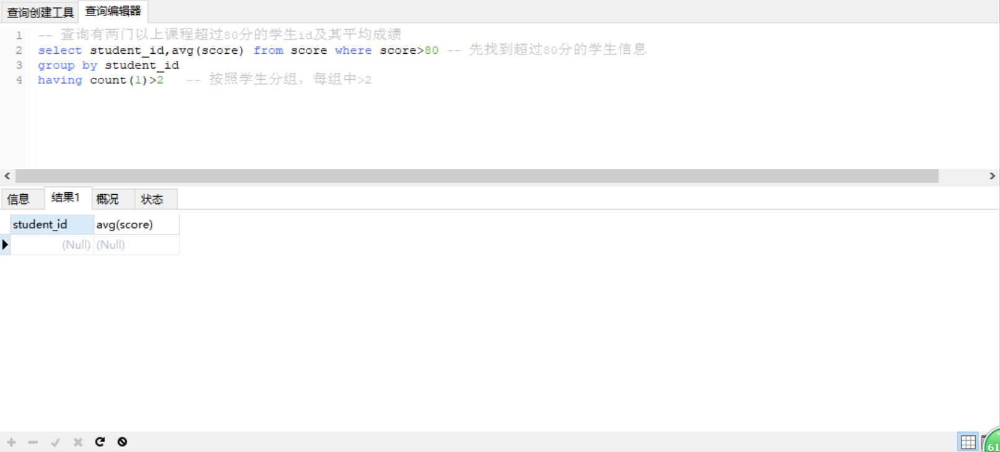

# 49、检索“3”课程分数小于60，按分数降序排列的同学学号；
```
-- 检索“3”课程分数小于60，按分数降序排列的同学学号
select score.student_id from score where score.course_id=3 -- 先找出课程号为3的数据
and score.score<60 -- 找出分数<60
order by score.score desc -- 按照分数降序排序
```


# 50、删除编号为“2”的同学的“1”课程的成绩；
```
-- 删除编号为“2”的同学的“1”课程的成绩
delete from score where score.student_id=2 and score.course_id=1
```

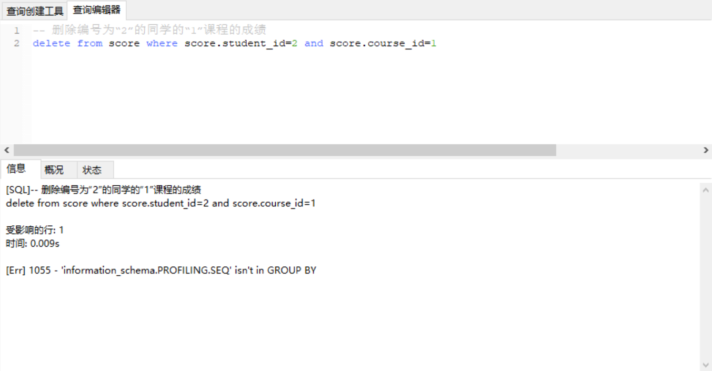

# 51、查询同时选修了物理课和生物课的学生id和姓名；
```
-- 查询同时选修了物理课和生物课的学生id和姓名
select student.sid,student.sname from student inner join score
on student.sid=score.student_id
inner join course
on score.course_id=course.cid
where course.cname in('物理','生物')-- 查询选修了物理或生物的学生信息
group by student.sid,student.sname -- 按照学生id和姓名分组，因为要显示id和名字
having count(*)=2 -- 要同时选秀了物理和生物的学生
```

