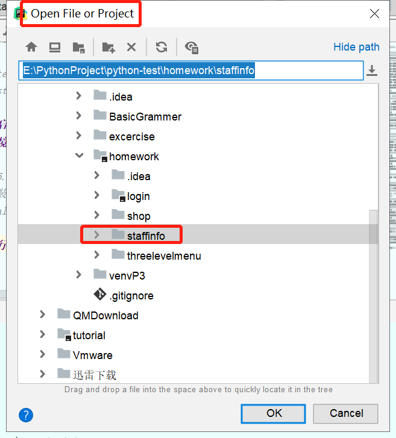
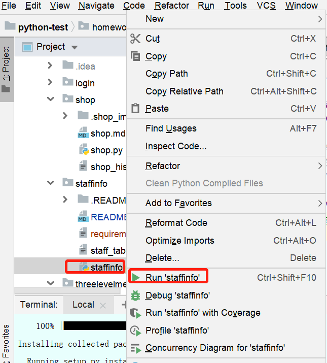
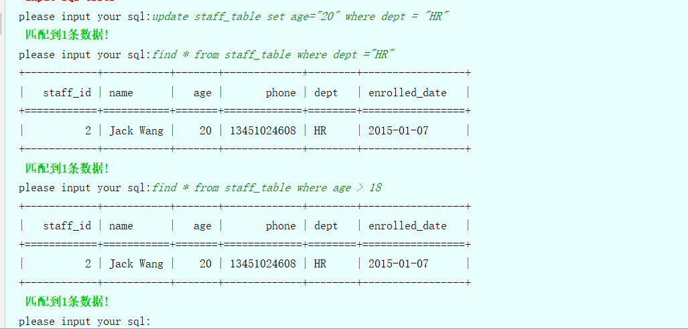
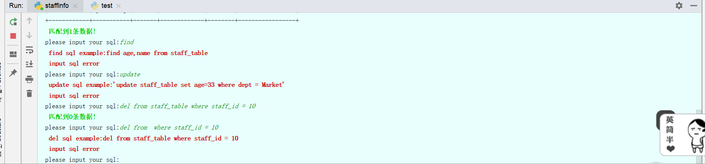
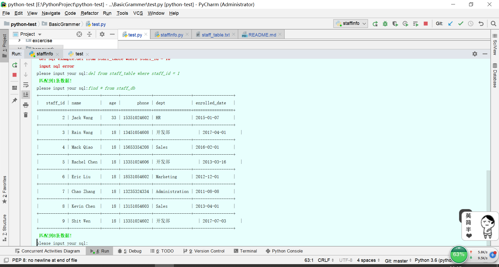
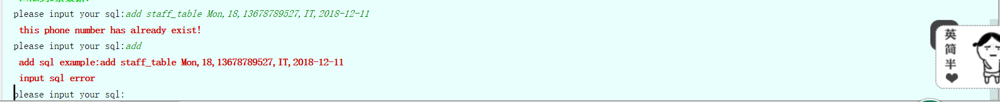
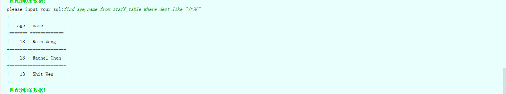
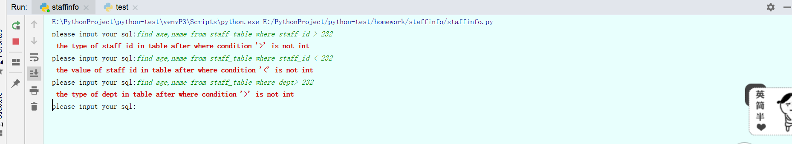

# 1.程序实现功能
```
现要求你写⼀个简单的员⼯信息增删改查程序，需求如下：
该表在⽂件中的存储⽅式：
⽂件名：staff_table（⽂件内容如下）
# 每⼀句对应的内容：序号,姓名,年龄,⼿机号,部分,⼊职时间
1,Alex Li,22,13651054608,IT,2013-04-01
2,Jack Wang,28,13451024608,HR,2015-01-07
3,Rain Wang,21,13451054608,IT,2017-04-01
4,Mack Qiao,44,15653354208,Sales,2016-02-01
5,Rachel Chen,23,13351024606,IT,2013-03-16
6,Eric Liu,19,18531054602,Marketing,2012-12-01
7,Chao Zhang,21,13235324334,Administration,2011-08-08
8,Kevin Chen,22,13151054603,Sales,2013-04-01
9,Shit Wen,20,13351024602,IT,2017-07-03
10,Shanshan Du,26,13698424612,Operation,2017-07-02
功能实现为主
⽂件（staff_table）⾏数据的说明
作业需求： 作业需求：
对⽤户输⼊的字符串进⾏解析，从⽂件中筛选出相应符合条件的结果集。
1 查⽂件 查⽂件((find))
find name,age from staff_table where age > 22
find * from staff_table where dept = "IT"
find * from staff_table where enroll_data like "2013"
demo 1
>>>:find name,age from staff_table where age > 22（提示：name和age之间
只有⼀个逗号没有空格）
要求：从staff_table⽂件中，找出员⼯年龄在22岁以上的员⼯，将这些员⼯的姓
名，员⼯的年龄打印出来
>>>:find name,age from staff_table where age > 22
对⽤户输⼊字符串的解析流程：
1 读⽂件
2 将每⼀个员⼯的年龄与22进⾏⽐较
3 获取到员⼯年龄⼤于22的员⼯信息
4 从符合条件的员⼯信息中筛选出员⼯的姓名、年龄
######## 结果展示 #######
>>>:find name from staff_table where age > 22
>>>:find name,age,phone,dept from staff_table where age > 22
补充：find 与from之间可以是*（*表示员⼯的所有信息）也可以是员⼯信息的任
意字段（多个字段可以⽤英⽂逗号隔开）
demo 2:
>>>:find * from staff_table where dept = "IT"
需求：从staff_table ⽂件中找到IT部⻔的员⼯，并打印员⼯的所有信息
demo 3:
>>>:find * from staff_table where enroll_data like "2013"
需求：从staff_table⽂件中找到员⼯的⼊职时间是2013年的员⼯，并打印员⼯所
有的信息
2 添加员⼯信息（⽤户的⼿机号不允许重复） 添加员⼯信息（⽤户的⼿机号不允许重复）
>>>:add staff_table Mosson,18,13678789527,IT,2018-12-11
需求：
添加员⼯信息时，必须有员⼯名称（Mosson）、员⼯年龄（18）、员⼯⼿
机号（13678789527）、员⼯部⻔（IT）、员⼯⼊职时间（2018-12-11）
将这些信息追加到staff_table⽂件新的⼀⾏中，并插⼊这⼀⾏的id
注意：添加员⼯的时候不考虑异常情况即添加的时候按照姓名,年龄,⼿机号,
部分,⼊职时间 且每⼀条数据都包含员⼯的完整数据（姓名、年龄、⼿机号、部
⻔、⼊职时间）
3 删除员⼯信息（根据序号删除相应员⼯的信息） 删除员⼯信息（根据序号删除相应员⼯的信息）
>>>:del from staff_table where id = 10
需求：从staff_table中删除序号id为10的这⼀条员⼯的信息
4 修改员⼯信息（可以根据特殊条件修改员⼯信息） 修改员⼯信息（可以根据特殊条件修改员⼯信息）
demo 1
>>>:update staff_table set dept="Market" where dept = "IT"
需求：将staff_table中dept为IT的修改成dept为Market
demo 2
>>>:update staff_table set age=25 where name = "Alex Li"
需求：将staff_table中⽤户名为Alex Li的⽤户的年龄改成25
```
# 2.程序启动方式
## 2.1环境介绍
```
python3.6.2
需要的安装包，在requirements.txt中
pip install -r requirements.txt
```
## 2.2运行代码


# 3.登录用户信息
该程序不需要用户登录
# 4.程序运行结果












# 5.流程图
